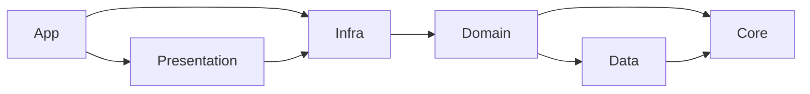

# 00. 전체 클래스 다이어그램 (개요·컨텍스트)

> 작성 기준일: 2026-08-03
> 문서 성격: `01`~`09` 컨텐츠별 설계서를 엮는 **개요/컨텍스트 다이어그램**. 클래스 상세 멤버·시퀀스는 각 문서에서 다루고, 여기서는 "무엇이 어디에 속하고 무엇을 참조하는가"만 보여준다.
> 근거: `구조개선_적용계획.md`(전체), `구조개선_전후비교.md`, `클래스다이어그램_개선반영_설계도.md`, `클래스다이어그램_수정_260801.md`, 선생님 피드백(`작업/클래스 다이어그램 리뷰 (트릭컬 리바이브 모작 기준).txt`)
> 대상 원본(Before, 참고용 — 이 문서가 대체하는 것 아님): `E:\Trickcal_Revive_Before\Assets\docs\클래스다이어그램_Unity.md`, `클래스다이어그램_정리.md`, `아키텍처_설계서.md`

## 0. 이 문서 세트를 읽는 법

- **구현 여부를 다루지 않는다.** 새 프로젝트(`E:\Trickcal_Revive`)는 아직 백지 상태다. 이 문서 세트는 "이렇게 설계됐다"는 목표만 다룬다.
- **Before(`E:\Trickcal_Revive_Before`)가 검증까지 마친 설계를 계승**하고, Before가 "화면이 없어 미룬" 항목(ViewModel 소비처, 이벤트 4종 배선, Command 실사용, 버프 23종 등)을 이번에 완성했다. 선생님 리뷰(개선 10건 + 권장 패턴 8종)에 없던 새 패턴은 추가하지 않는다.
- 표기: `<<MonoBehaviour>>` = Unity 컴포넌트, `<<Serializable>>` = 순수 데이터(POCO), `<<interface>>`/`<<enumeration>>` = C# 타입.
- mermaid `namespace` 블록 이름의 `_`는 실제 C# 네임스페이스의 `.`을 대체한 것이다(mermaid 문법 제약).

## 1. 문서 색인

| # | 문서 | 핵심 패턴/개선 | 상태 |
|---|---|---|---|
| 00 | 전체_클래스다이어그램.md (이 문서) | — | 작성 완료 |
| 01 | 계정인증_설계서.md | Repository, DIP | 작성 완료 |
| 02 | 로비화면전환_설계서.md | Navigation, Popup | 작성 완료 |
| 03 | 파티편성_설계서.md | Command, Undo | 작성 완료 |
| 04 | 전투_설계서.md | State, Component, Decorator, Strategy, BattleResultBuilder | 작성 완료 |
| 05 | 가챠_설계서.md | Sequencer 분리(연출↔계산) | 작성 완료 |
| 06 | 사도성장_설계서.md | Mapper, Value Object, Specification | 작성 완료 |
| 07 | 인벤토리재화_설계서.md | Observer(이벤트 발행처 완성) | 작성 완료 |
| 08 | 저장_설계서.md | SaveHandler 분해 | 작성 완료 |
| 09 | 공통기반_설계서.md | DI, EventBus, StateMachine, Repository DIP, asmdef | 작성 완료 |
| 10 | 사도스탯성장_설계서.md | 기본 스탯 공식, 공용 성장 테이블(레벨/성급/스킬레벨) | 작성 완료 |
| 11 | 사도스킬_설계서.md | 30명 스킬 데이터(`combat_master` 구조), 버프/디버프 ID 카탈로그 | 작성 완료 |
| 12 | 몬스터스탯스킬_설계서.md | 몬스터 20종(4역할원형×5성격), 데미지 공식 신규 확정 | 작성 완료 |

## 2. 계층 구조 (모든 문서에 적용되는 전제)



`Domain`은 `Infra`를 참조하지 않는다(DIP) — 상세는 `09_공통기반_설계서.md` §1·§5.

## 3. 도메인 패키지 개요

9개 컨텐츠 문서가 다루는 핵심 클래스와 도메인 간 의존 관계만 담은 컨텍스트 다이어그램이다. 각 박스 안 클래스는 대표 5~10개만 표시하며, 전체 멤버·나머지 클래스는 해당 문서에서 확인한다.

```mermaid
classDiagram
    direction TB

    namespace 01_계정인증 {
        class AuthController { <<MonoBehaviour>> }
        class SettingsController { <<MonoBehaviour>> }
        class AccountAuthRepository
        class SessionService
    }

    namespace 02_로비화면전환 {
        class LobbyController { <<MonoBehaviour>> }
        class SceneFlowController { <<MonoBehaviour>> }
        class INavigationService { <<interface>> }
        class IPopupService { <<interface>> }
        class NavigationHistory
        class PopupService
    }

    namespace 03_파티편성 {
        class StageSelectController { <<MonoBehaviour>> }
        class PartySetupController { <<MonoBehaviour>> }
        class PartyFormationValidator
        class ICommand { <<interface>> }
        class AssignSlotCommand
        class CommandHistory
        class BattleStartRequestBuilder
    }

    namespace 04_전투 {
        class BattleController { <<MonoBehaviour>> }
        class BattleFacade
        class IBattleState { <<interface>> }
        class BattleUnit
        class BuffUnitStats
        class ITargetingStrategy { <<interface>> }
        class BattleResultBuilder
    }

    namespace 05_가챠 {
        class GachaController { <<MonoBehaviour>> }
        class GachaService
        class GachaRevealSequencer
        class GachaResultGridController { <<MonoBehaviour>> }
    }

    namespace 06_사도성장 {
        class RosterController { <<MonoBehaviour>> }
        class CharacterDetailController { <<MonoBehaviour>> }
        class Character
        class OwnedCharacter
        class CharacterMapper
        class CharacterGrowthService
        class ISpecification~T~ { <<interface>> }
    }

    namespace 07_인벤토리재화 {
        class InventoryService
        class RewardService
        class RewardCalculator
        class BackpackController { <<MonoBehaviour>> }
    }

    namespace 08_저장 {
        class ISaveManager { <<interface>> }
        class SaveManager
        class CharacterSaveHandler
        class BattleResultSaveHandler
    }

    namespace 09_공통기반 {
        class DI
        class EventBus
        class IStateMachine~TState~ { <<interface>> }
        class ICharacterRepository { <<interface>> }
        class IPlayerCharacterRepository { <<interface>> }
        class IGrowthRepository { <<interface>> }
        class IInventoryRepository { <<interface>> }
    }

    AuthController --> AccountAuthRepository
    AuthController --> SessionService
    SettingsController --> SessionService

    LobbyController --> INavigationService
    LobbyController --> IPopupService
    SceneFlowController ..|> INavigationService
    PopupService ..|> IPopupService
    SceneFlowController --> NavigationHistory

    StageSelectController --> INavigationService
    PartySetupController --> ICommand
    AssignSlotCommand ..|> ICommand
    PartySetupController --> CommandHistory
    PartySetupController --> BattleStartRequestBuilder
    PartySetupController --> PartyFormationValidator
    BattleStartRequestBuilder --> BattleController : 전투 진입

    BattleController --> BattleFacade
    BattleFacade --> IBattleState
    BattleFacade --> BattleUnit
    BattleUnit --> BuffUnitStats
    BattleFacade --> ITargetingStrategy
    BattleFacade --> BattleResultBuilder
    BattleResultBuilder --> RewardCalculator : 보상 계산 위임

    GachaController --> GachaService
    GachaController --> GachaRevealSequencer
    GachaRevealSequencer --> GachaResultGridController

    RosterController --> ISpecification~T~
    RosterController --> OwnedCharacter
    CharacterMapper --> Character
    CharacterMapper --> OwnedCharacter
    CharacterDetailController --> CharacterGrowthService
    CharacterGrowthService --> IGrowthRepository

    InventoryService --> IInventoryRepository
    RewardService --> RewardCalculator
    BackpackController --> InventoryService

    SaveManager ..|> ISaveManager
    SaveManager --> CharacterSaveHandler
    SaveManager --> BattleResultSaveHandler

    AuthController --> IStateMachine~TState~ : (해당 없음, 예시)
    PartySetupController --> ICharacterRepository
    RosterController --> ICharacterRepository
    BattleResultBuilder --> EventBus : BattleEndedEvent 발행
    CharacterGrowthService --> EventBus : CharacterLevelUpEvent 발행
    InventoryService --> EventBus : CurrencyChangedEvent 발행
```



**읽는 법:** 화살표는 "참조/의존"이며 실제 계층 규칙(§2)을 어기지 않는다 — 예를 들어 `PartySetupController`(Presentation)가 `ICommand`(Domain 인터페이스)를 참조하는 것은 허용되지만, `Domain`의 클래스가 `Presentation`을 참조하는 화살표는 이 다이어그램에 존재하지 않는다. 상세 시그니처와 나머지 클래스(예: `BattleUnit`의 5개 컴포넌트, `Command` 5종 전체, `Specification` 5종 전체)는 각 컨텐츠 문서에서 확인한다.

## 4. 화면 흐름 대비표

`전체_기획서.md` §3의 화면 흐름과 컨텐츠 문서의 대응 관계다.

```
Login(01) → Lobby(02) ─┬─ StageSelect(03) → PartySetup(03) → Loading → Battle(04) → ResultOverlay(04,07)
                        ├─ Gacha(05)
                        ├─ Roster(06) → CharacterDetail(06)
                        └─ (메뉴) Backpack(07) / 설정(01)

저장(08)과 공통기반(09)은 특정 화면이 아니라 전체를 관통한다.
```

## 5. 규모 예상 (참고)

Before는 개선 10건 + 패턴 8종 적용으로 클래스 수가 기존 대비 약 2배(약 55개+)가 됐다. 이번 문서 세트는 거기에 더해 **버프/디버프 23종 완성, 이벤트 4종 발행처(인벤토리·보상·스테이지진행 서비스) 신설, 소환수·MVP 지연판정** 등을 추가로 설계하므로, 전체 클래스 수는 이보다 더 늘어날 것으로 예상된다(정확한 수는 09·04를 제외한 나머지 문서 작성 후 갱신).

| 구분 | Before(개선 적용 후) | 이번 세트 (예상) |
|---|---|---|
| 신규 인터페이스 | 약 20개 | 유지 + `RegisterFactory`, `ITargetingStrategy` 확장 등 소폭 증가 |
| 신규 클래스 | 약 55개+ | 버프/디버프 완성분(§4_전투 §4)만 15개 안팎 추가 |
| 검증 | EditMode 237/237 | (새 프로젝트 재구현 후 별도 측정) |

## 6. 완성 항목 총괄 (문서별)

Before가 "화면이 없어 미룬" 항목을 문서별로 완성한 결과다. 상세는 각 문서 말미의 "완성 요약" 표를 참고한다.

| 문서 | 이번에 완성한 것 |
|---|---|
| 01 계정인증 | 계정 초기화 시 세이브 6종 전체 삭제 오케스트레이션(`ISaveManager.DeleteAll`) |
| 02 로비화면전환 | `ShowLoading` 실제 구현, 전환 중 입력 차단 오버레이, MainUI 팝업 닫기 배선 |
| 03 파티편성 | `AssignSlotCommand`/`RemoveSlotCommand` 화면 배선(되돌리기 버튼), `StageProgressService` 실구현 + `StageClearedEvent` |
| 04 전투 | 버프/디버프 23종(보호막·HoT·소환수·피해반사·거대화·MVP·인형의 의지 실행부 등), 타겟팅 12종 확정 |
| 05 가챠 | Repository DIP 경계(`ICurrencyWallet`+`IPlayerCharacterRepository`로 좁힘) |
| 06 사도성장 | `RosterController`/`CharacterDetailController` 실설계, ViewModel 계층, 성장 Command 화면 배선, 필터 프리셋 저장 |
| 07 인벤토리재화 | `InventoryService`/`RewardService` 실구현, `CurrencyChanged`/`InventoryChanged`/`RewardGranted` 이벤트, `BackpackController` |
| 08 저장 | 각 서비스의 저장 호출 배선, `SaveManager.SaveAll`/`DeleteAll` |
| 09 공통기반 | `DI.RegisterFactory`, `AutoUnsubscribe` 헬퍼, 이벤트 4종 완성(발행처는 07·03) |
| 10 사도스탯성장 | 30명 기본 스탯·SP·액티브 쿨타임 확정, 성급·스킬레벨 성장 테이블 신규 설계, `IBase` 인터페이스 갱신 |
| 11 사도스킬 | 30명 스킬을 `combat_master.skills/effects/conditions` 구조로 전환, 버프/디버프 34종 ID 카탈로그 |

## 6-1. 데이터 계층(10·11) 추가 메모

`10`·`11`은 `00`~`09`(아키텍처)와 성격이 다르다 — 클래스 구조가 아니라 **그 구조에 채워 넣는 실제 게임 데이터**(30명 스탯·성장·스킬)다. `04_전투_설계서.md`(버프/디버프·타겟팅 카탈로그)와 `06_사도성장_설계서.md`(`IBase` 등 캐릭터 도메인 모델)를 소비하는 관계다. 몬스터 스탯·스킬은 몬스터 20종 선정이 선행돼야 해 이번 범위에서 제외됐다(별도 세션).

## 7. 남은 확인 사항

- 확정 완료(2026-08-03): 소환수 상한 초과 처리(오래된 것부터 제거), 보호막 파괴 범위(전량 제거), 빅우드 SP(일반 보호막으로 설계 변경), `HpFloorRatio` 중첩(가장 높은 값 우선), 별 조건 규칙(1★클리어/2★사망1회이하/3★무사망, 전역 고정 — `04_전투_설계서.md` §6), 스테이지 최고 기록 갱신 방식(모노토닉 — `03_파티편성_설계서.md` §3), 필터 프리셋 JSON 트리 구조(`06_사도성장_설계서.md` §6, 그대로 유지), `SaveAllRequest` 구조(`08_저장_설계서.md` §3, 그대로 유지).
- 확정 완료(2026-08-04): `StatusEffect`를 identity/수명 + `IEffectPayload`(`StatModifierPayload`/`TickPayload`/`ControlPayload`/`HpFloorPayload`)로 처음부터 분리 적용(`04_전투_설계서.md` §4.2) — 필드 늘어난 뒤 나중에 쪼개는 대신 미리 적용.
- 확정 완료(2026-08-04): 사도 기본 스탯 산출 정책(역할·배치 공식으로 자체 설계, 스킬 계수는 원작값 재사용), 액티브 스킬 쿨타임 정책(사도별 원작값 채택 — `전체_기획서.md` §4.3 "10초 고정" 서술을 대체, `10_사도스탯성장_설계서.md` §6), 성급·스킬레벨 성장 테이블 수식.
- 확정 완료(2026-08-04, 몬스터): 몬스터 20종 구조(4역할원형×5성격, Before "몬스터 6종" 전면 대체), 데미지 공식(`max(1, ATK×계수-DEF)`, `04_전투_설계서.md` §3.1에 소급 반영), 몬스터 HP 간이 역산, 웨이브 코스트 예산제(`레벨디자인_설계서.md` §4.1의 고정 마리수 표를 대체, `12` §7).
- 확정 완료(2026-08-05): 정예·보스는 챕터·웨이브 위치 제약 없이 모든 곳에 자유 배정 가능 — `레벨디자인_설계서.md` §4.2·§4.3(챕터별 정예 제한, 보스 전용 위치) **폐기**. 보스는 `character_master`의 별도 개체가 아니라 웨이브 스폰 시점에 적용되는 강도 등급(`MonsterGrade`)이며, `DB_설계서.md`의 `entity_type=boss` 값도 이에 따라 폐기 대상(`12_몬스터스탯스킬_설계서.md` §7·§9).
- 확정 완료(2026-08-04, 정책 재변경): 이동속도를 전역 강제값에서 **캐릭터별 개별 필드(기준값 2.0)**로 변경 — `IBase.MoveSpeed` 복원(`06_사도성장_설계서.md` §1), `Electrocute`·바리에 SP의 이동속도 감소 반영 가능해짐(`11_사도스킬_설계서.md` §7 해소).
- 검증 예정(실제 전투 시뮬레이션 대기, 2026-08-04 확정): 사도 역할·성급 밸런스, 몬스터 HP/ATK/DEF·SP버스트 보정 배율, 성급·스킬레벨 성장 비용 곡선, 데미지 공식 체감 밸런스 — 전부 `10_사도스탯성장_설계서.md` §7·`12_몬스터스탯스킬_설계서.md` §8에 목록화.
- 확정 완료(2026-08-05): 웨이브 배치 가이드라인 — 등급 밀도 곡선(진행도에 따라 정예·보스 비중 15%→85% 선형 증가), 성격 로테이션 규칙(5스테이지 주기 순환), 챕터 보스 권장 관례(강제 아님) — `12_몬스터스탯스킬_설계서.md` §8.
- 남은 참고 메모: 정확한 100스테이지 실제 배치(`stage_master.waves_json`)는 여전히 범위 밖(공식·로테이션 규칙만 제공, `12` §8.4), 등급 밀도 곡선 계수(0.15/0.85/0.007)는 임의값이라 시뮬레이션 후 조정 필요(`12` §9).
- `DB_설계서.md`/`레벨디자인_설계서.md`는 이번 설계 세트가 요구하는 변경(§8 `04_전투_설계서.md`의 `combat_master.buffs/debuffs`, `character_master.base_stats_json` 9→12개 확장, 웨이브 코스트 예산제, `entity_type.boss` 폐기 등)을 아직 반영하지 않은 상태다 — **데이터 테이블이 더 안정화된 뒤 일괄 반영하기로 결정**(2026-08-04). 별 조건 관련 필드(`StageMasterData.StarConditions1/2`/`star_conditions_json`)는 전역 규칙 확정으로 불필요해져 제거 가능.
