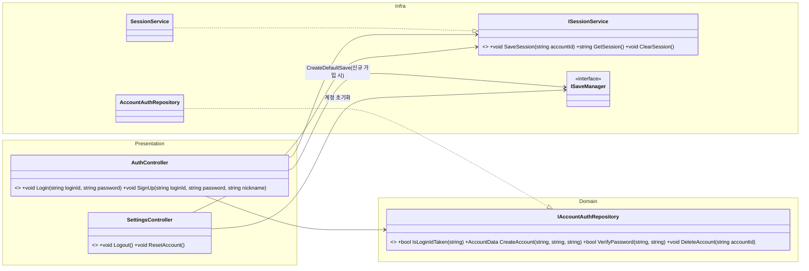
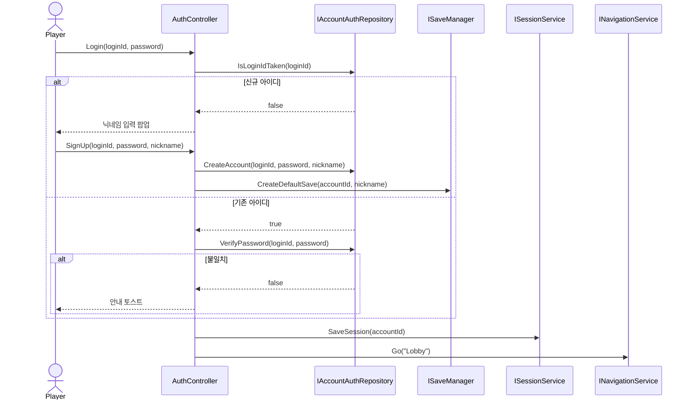
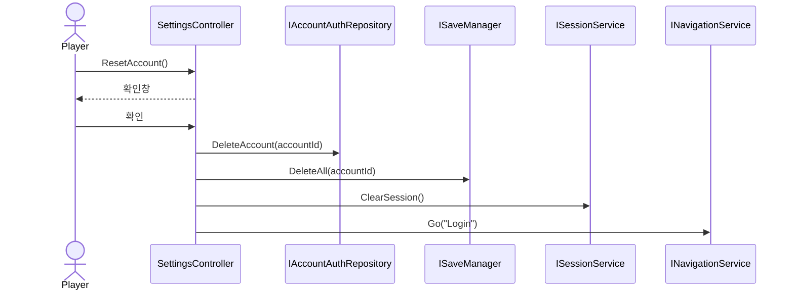

# 01. 계정·인증 설계서

> 작성 기준일: 2026-08-03
> 문서 성격: Before 계승 + 미룬 항목 완성. 근거: `아키텍처_설계서.md` §2(원본 대비 변경), `구조개선_적용계획.md` §2, `전체_기획서.md` §2
> 공통 기반(DI/EventBus/Repository DIP)은 `09_공통기반_설계서.md` 참고.

## 0. 범위

로그인/가입, 세션 유지, 로그아웃/계정초기화. `전체_기획서.md` §2가 정한 게임 룰(ID+PW, 평문 저장, 아이디=키라 자동 중복 방지)은 바꾸지 않는다 — 구조만 다룬다.

## 1. 클래스 구조



| 클래스 | 계층 | 책임 |
|---|---|---|
| `AuthController` | Presentation | 로그인/가입 화면. 신규 아이디면 닉네임 입력 후 `IAccountAuthRepository.CreateAccount` → `ISaveManager`로 기본 세이브 생성 |
| `SettingsController` | Presentation | 로비 설정 팝업. 로그아웃(세션만 해제)과 계정 초기화(데이터 전부 삭제)를 구분 |
| `IAccountAuthRepository` / `AccountAuthRepository` | Domain / Infra | 계정 자격 증명 전담. 일반 저장 데이터(`IAccountRepository` 등, `09` 참고)와 분리 — 비밀번호 검증은 "계정을 어떻게 저장하는가"와 다른 관심사 |
| `ISessionService` / `SessionService` | Infra | 새로고침 후에도 유지되는 로그인 세션(마지막 로그인 아이디) |

Before의 원본(`LoginController`, 게스트 로그인/이어하기)이 `AuthController`(아이디+비밀번호)로 교체된 이력은 `아키텍처_설계서.md` §2.1에 기록돼 있고, 그 결정을 그대로 계승한다.

## 2. 완성 항목 — 계정 초기화의 전체 삭제 범위

Before는 `SettingsController.ResetAccount()`가 "아이디·비밀번호·세이브 데이터를 전부 삭제한다"는 룰만 `전체_기획서.md` §2에 명시하고, **어떤 클래스들을 지워야 "전부"인지**는 구조로 확정하지 않았다. `08_저장_설계서.md`가 세이브를 6개 파일(계정/사도/파티/인벤토리/진행도/전투결과)로 쪼갰으므로, 계정 초기화는 이 6개 전부 + 인증 레코드까지 지워야 한다.

```
SettingsController.ResetAccount()
├ 확인 팝업
└ 확인 시:
    1. IAccountAuthRepository.DeleteAccount(accountId)   — 로그인 자격 삭제
    2. ISaveManager.DeleteAll(accountId)                  — 6개 세이브 파일 전부 삭제 (신규, 08 참고)
    3. ISessionService.ClearSession()
    4. INavigationService.Go("Login")                     (02 참고)
```

`ISaveManager.DeleteAll`은 `08_저장_설계서.md`에서 정의한다 — 저장 핸들러 6개를 아는 것은 그 문서의 책임이라, 여기서는 "계정 초기화는 인증 삭제 + 세이브 전체 삭제 + 세션 해제 3단계"라는 흐름만 못박는다.

## 3. 시퀀스 다이어그램

### 3-1. 로그인/가입



### 3-2. 계정 초기화



## 4. 완성 요약

| 항목 | Before 상태 | 이번 완성 |
|---|---|---|
| `IAccountAuthRepository`/`ISessionService` 인터페이스화 | 완료 | 계승 |
| 계정 초기화 시 6개 세이브 파일 전체 삭제 오케스트레이션 | 미정 (룰만 있고 구조 없음) | **완성** — `ISaveManager.DeleteAll` (§2, `08_저장_설계서.md`와 연결) |
