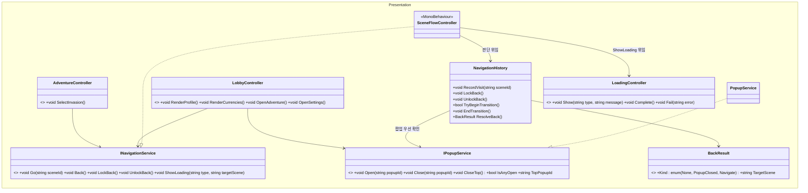
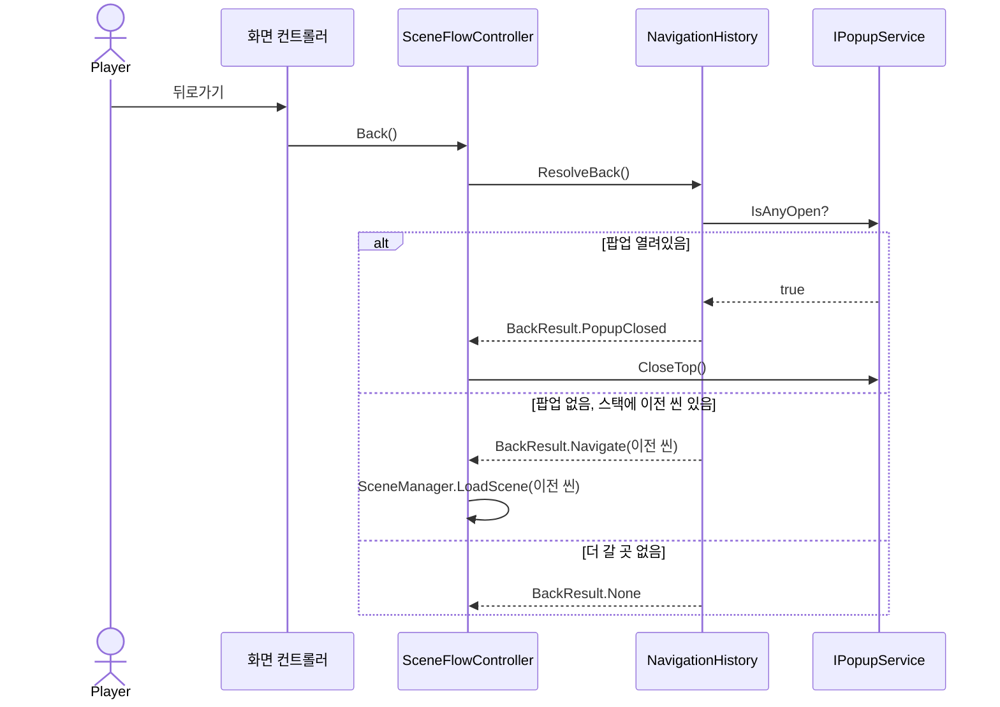
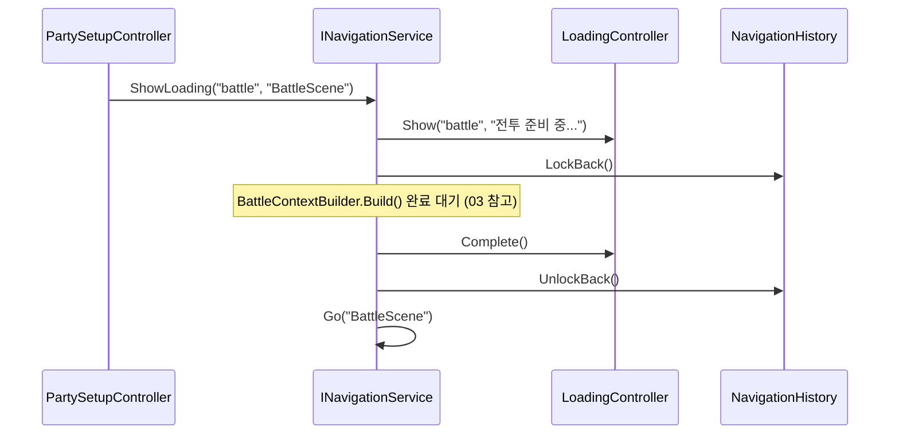

# 02. 로비·화면전환 설계서 (Navigation)

> 작성 기준일: 2026-08-03
> 문서 성격: Before 계승 + 미룬 항목 완성. 근거: `Navigation_설계서.md`, `구조개선_적용계획.md` §14, `클래스다이어그램_개선반영_설계도.md` §11, `전체_기획서.md` §3
> 공통 기반(DI)은 `09_공통기반_설계서.md` 참고.

## 0. 범위

로비 화면 자체와, 모든 화면이 공유하는 씬 전환·팝업 관리. Before 리뷰 8번("Controller 간 직접 참조")이 이 영역이었다 — 확인 결과 씬 전환은 이미 `SceneFlowController`를 경유하고 있었고, 다이어그램에 화살표가 빠져 직접 참조로 보였을 뿐이었다(표기 오류, 구조 문제 아님).

## 1. 클래스 구조



**판단(무엇을 할지)과 실행(실제 씬 전환)을 분리한다** — `04_전투_설계서.md`의 `BattleLoop`/`BattleFacade` 분리와 같은 원칙이다. `SceneFlowController`가 `SceneManager.LoadScene`을 직접 부르면 EditMode 테스트에서 존재하지 않는 씬 이름 때문에 에러가 나거나 느려진다. 그래서 `NavigationHistory`(순수 C#)가 씬 방문 스택·팝업 우선순위·잠금 상태를 전담해 유니티 없이 테스트되고, `SceneFlowController`는 그 결과(`BackResult`)를 받아 `SceneManager.LoadScene` 한 줄만 부른다.

## 2. 완성 항목

Before는 `INavigationService`/`IPopupService`/`Go`/`Back`/`LockBack`/`UnlockBack`까지는 완성하고, 아래 3개는 "소비할 구체 요구가 없다"는 이유로 미뤘다. 이번엔 로비·전투 진입 흐름이 실제로 이 셋을 요구하므로 완성한다.

### 2.1 `ShowLoading` 실제 구현

`전체_기획서.md` §3 화면 흐름표의 `PartySetup → Loading → Battle` 전이가 이 메서드에 의존한다. `LoadingController`(원본 다이어그램에 이미 존재하던 클래스)를 씬 전환과 묶는다.

```
INavigationService.ShowLoading(type, targetScene)
└ SceneFlowController가:
    1. LoadingController.Show(type, "전투 준비 중...")
    2. NavigationHistory.LockBack()          — 로딩 중 뒤로가기 차단
    3. (비동기) targetScene 로드
    4. 성공 시 LoadingController.Complete() → UnlockBack() → Go(targetScene)
    5. 실패 시 LoadingController.Fail(error) → UnlockBack()
```

### 2.2 화면 전환 중 입력 차단

`NavigationHistory.TryBeginTransition()`/`EndTransition()`이 이미 재진입 방지(`isTransitioning` 플래그)를 제공한다(Before 완료). 이번엔 여기에 **시각적 오버레이**를 연결한다 — `Go()`/`Back()` 호출 시 `TryBeginTransition()`이 `true`를 반환하는 동안 `LoadingController.Show("transition", null)`로 반투명 차단막을 띄우고, `EndTransition()` 시점에 `Complete()`로 걷는다. 로딩 문구 없이 오버레이만 쓰는 경량 모드로 `LoadingController`를 재사용한다(새 클래스 불필요).

### 2.3 팝업 닫기 배선

Before는 "MainUI가 팝업을 닫을 때 `IPopupService.Close()`를 실제로 부르는 것"을 MainUI가 별도 모듈이라는 이유로 범위 밖에 뒀다. 이 프로젝트에서 MainUI는 실제 화면 렌더링을 담당하는 표현 계층 모듈이므로, **팝업 뷰의 닫기 버튼 핸들러**가 이 지점이다.

```
StageInfoPopupView(MainUI) 닫기 버튼 클릭
└ popupService.Close("StageInfo")   ← IPopupService, DI로 주입받음

SettingsPopupView(MainUI) 닫기 버튼 클릭
└ popupService.Close("Settings")
```

여는 지점(`StageSelectController.OpenStageInfo`, `LobbyController.OpenSettings`)이 이미 `IPopupService.Open()`을 부르므로, 닫는 지점만 대칭으로 채우면 된다 — 새 구조는 필요 없다.

## 3. 시퀀스 다이어그램

### 3-1. 뒤로가기 (팝업 우선)



### 3-2. 전투 진입 로딩



## 4. 완성 요약

| 항목 | Before 상태 | 이번 완성 |
|---|---|---|
| `INavigationService`/`IPopupService`/`NavigationHistory` | 완료(뒤로가기 스택, 잠금 포함) | 계승 |
| `ShowLoading` 실제 구현 | 스텁 | **완성** — `LoadingController` 연동 |
| 전환 중 시각적 입력 차단 | 재진입 방지 플래그만 | **완성** — 오버레이 연결 |
| MainUI 팝업 닫기 배선 | 범위 밖(닫기 지점 없음) | **완성** — 팝업 뷰 닫기 버튼 → `Close()` |
