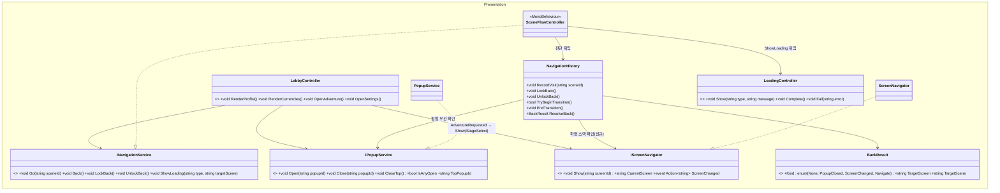
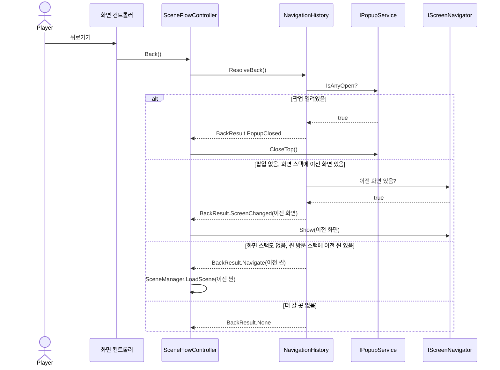
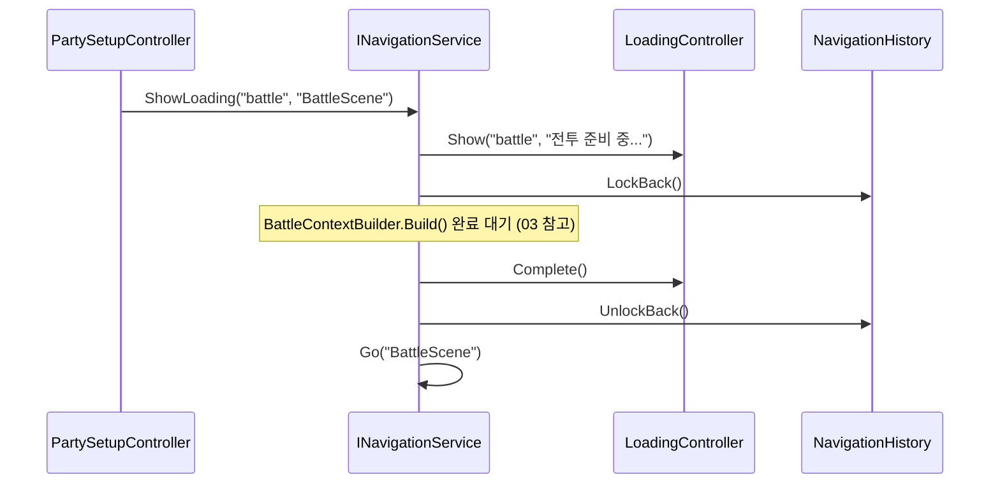

# 02. 로비·화면전환 설계서 (Navigation)

> 작성 기준일: 2026-08-03
> 문서 성격: Before 계승 + 미룬 항목 완성. 근거: `Navigation_설계서.md`, `구조개선_적용계획.md` §14, `클래스다이어그램_개선반영_설계도.md` §11, `전체_기획서.md` §3
> 공통 기반(DI)은 `09_공통기반_설계서.md` 참고.

## 0. 범위

로비 화면 자체와, 모든 화면이 공유하는 씬 전환·팝업·**Main씬 내부 화면 전환** 관리. Before 리뷰 8번("Controller 간 직접 참조")이 이 영역이었다 — 확인 결과 씬 전환은 이미 `SceneFlowController`를 경유하고 있었고, 다이어그램에 화살표가 빠져 직접 참조로 보였을 뿐이었다(표기 오류, 구조 문제 아님).

**추가(결정 2026-08-05, 개발 구현 중 발견).** Before의 실제 씬 파일은 4개뿐이었다(Login/Loading/Main/Battle) — `StageSelect`/`PartySetup`/`Roster`/`Gacha`/`Backpack` 전용 씬은 없었고, 전부 **Main씬 안의 화면(패널)** 이다. 그런데 이 문서 체계에는 지금까지 씬 전환(`INavigationService.Go`)과 모달 팝업(`IPopupService`) 둘뿐이었고, "같은 씬 안에서 패널만 바꾸는" 세 번째 개념이 없었다. §5에서 `IScreenNavigator`로 채운다.

## 1. 클래스 구조



**`AdventureController`는 별도 화면이 아니다(정정, 2026-08-05).** 이전 판에 독립 클래스로 있었으나, 실제로는 `LobbyScreenView.AdventureRequested` 이벤트를 받아 `IScreenNavigator.Show(ScreenIds.StageSelect)`를 호출하는 것이 전부라 `LobbyController`의 메서드(`OpenAdventure()`)로 흡수한다 — 새 컨트롤러를 두면 상태 없는 글루 코드만 담는 빈 클래스가 된다.

**판단(무엇을 할지)과 실행(실제 씬 전환)을 분리한다** — `04_전투_설계서.md`의 `BattleLoop`/`BattleFacade` 분리와 같은 원칙이다. `SceneFlowController`가 `SceneManager.LoadScene`을 직접 부르면 EditMode 테스트에서 존재하지 않는 씬 이름 때문에 에러가 나거나 느려진다. 그래서 `NavigationHistory`(순수 C#)가 씬 방문 스택·팝업 우선순위·잠금 상태를 전담해 유니티 없이 테스트되고, `SceneFlowController`는 그 결과(`BackResult`)를 받아 `SceneManager.LoadScene` 한 줄만 부른다.

## 2. 완성 항목

Before는 `INavigationService`/`IPopupService`/`Go`/`Back`/`LockBack`/`UnlockBack`까지는 완성하고, 아래 3개는 "소비할 구체 요구가 없다"는 이유로 미뤘다. 이번엔 로비·전투 진입 흐름이 실제로 이 셋을 요구하므로 완성한다.

### 2.1 `ShowLoading` 실제 구현

`전체_기획서.md` §3 화면 흐름표의 `PartySetup → Loading → Battle` 전이가 이 메서드에 의존한다. `LoadingController`(원본 다이어그램에 이미 존재하던 클래스)를 씬 전환과 묶는다.

```
INavigationService.ShowLoading(type, targetScene)
└ SceneFlowController가:
    1. LoadingController.Show(type, "전투 준비 중...")
    2. NavigationHistory.LockBack()          — 로딩 중 뒤로가기 차단
    3. (비동기) targetScene 로드
    4. 성공 시 LoadingController.Complete() → UnlockBack() → Go(targetScene)
    5. 실패 시 LoadingController.Fail(error) → UnlockBack()
```

### 2.2 화면 전환 중 입력 차단

`NavigationHistory.TryBeginTransition()`/`EndTransition()`이 이미 재진입 방지(`isTransitioning` 플래그)를 제공한다(Before 완료). 이번엔 여기에 **시각적 오버레이**를 연결한다 — `Go()`/`Back()` 호출 시 `TryBeginTransition()`이 `true`를 반환하는 동안 `LoadingController.Show("transition", null)`로 반투명 차단막을 띄우고, `EndTransition()` 시점에 `Complete()`로 걷는다. 로딩 문구 없이 오버레이만 쓰는 경량 모드로 `LoadingController`를 재사용한다(새 클래스 불필요).

### 2.3 팝업 닫기 배선

Before는 "MainUI가 팝업을 닫을 때 `IPopupService.Close()`를 실제로 부르는 것"을 MainUI가 별도 모듈이라는 이유로 범위 밖에 뒀다. 이 프로젝트에서 MainUI는 실제 화면 렌더링을 담당하는 표현 계층 모듈이므로, **팝업 뷰의 닫기 버튼 핸들러**가 이 지점이다.

```
StageInfoPopupView(MainUI) 닫기 버튼 클릭
└ popupService.Close("StageInfo")   ← IPopupService, DI로 주입받음

SettingsPopupView(MainUI) 닫기 버튼 클릭
└ popupService.Close("Settings")
```

여는 지점(`StageSelectController.OpenStageInfo`, `LobbyController.OpenSettings`)이 이미 `IPopupService.Open()`을 부르므로, 닫는 지점만 대칭으로 채우면 된다 — 새 구조는 필요 없다.

### 2.4 `IScreenNavigator` — Main씬 내부 화면 전환 (신규, 결정 2026-08-05)

`INavigationService`(씬 전환)와 `IPopupService`(모달)로는 "Main씬 안에서 패널만 바꾸는" 경우를 표현할 수 없었다. Login/Battle은 독립 씬이라 `Go()`로 충분하지만, `Lobby`→`StageSelect`→`PartySetup`(그리고 향후 `Roster`/`CharacterDetail`/`Gacha`/`Backpack`)은 전부 Main씬 안의 화면이다.

```
IScreenNavigator (Presentation)
├ void Show(string screenId)
├ string CurrentScreen { get; }
└ event Action<string> ScreenChanged

ScreenNavigator : IScreenNavigator
├ 화면 방문 스택을 자체적으로 갖는다(뒤로가기 통합용, §2.5)
└ Show(id) 호출 시: 스택에 CurrentScreen을 쌓고 → CurrentScreen = id → ScreenChanged 발행
```

**GameObject를 직접 켜고 끄지 않는다** — `Show`는 화면 id가 바뀌었다는 이벤트만 발행한다. 실제 표시·숨김·전환 연출은 MainUI가 `ScreenChanged`를 구독해 처리한다(§2.3의 팝업 닫기 배선과 같은 성격의 통합 지점 — Presentation은 "무엇을 보여줄지"만 결정하고 "어떻게 그릴지"는 MainUI 몫).

**데이터 전달은 `Show()`에 태우지 않는다.** `Show(string screenId)`는 페이로드가 없는 순수 신호다. 화면 간 데이터(예: 어느 스테이지를 골랐는지)는 **전환을 트리거하는 컨트롤러가 대상 컨트롤러의 명시적 진입 메서드를 먼저 호출**한 다음 `Show()`를 부르는 것으로 해결한다 — 새 범용 페이로드 버스를 만들지 않는다.

```csharp
// StageInfoPopupController.EnterPartySetup()
public void EnterPartySetup()
{
    partySetupController.EnterForStage(_currentStageId);  // 타입 있는 직접 호출
    screenNavigator.Show(ScreenIds.PartySetup);            // 화면 전환은 신호만
    popupService.Close("StageInfo");
}
```

`PartySetupController.EnterForStage(StageId)`가 새 진입점이다(`03_파티편성_설계서.md` §1 참고) — `RenderFormation()`은 화면이 보이기 시작한 뒤 갱신용으로 그대로 둔다.

#### `ScreenIds` 카탈로그 (전체 목록 선반영, 배선은 이번 스코프 3개만)

| 화면 ID | 담당 컨트롤러 | 배선 상태 |
|---|---|---|
| `Lobby` | `LobbyController` | **배선 완료**(이번) |
| `StageSelect` | `StageSelectController` | **배선 완료**(이번) |
| `PartySetup` | `PartySetupController` | **배선 완료**(이번) |
| `Roster` | `RosterController` | 미배선 — `06_사도성장_설계서.md` 착수 시 |
| `CharacterDetail` | `CharacterDetailController` | 미배선 — `06` 착수 시 |
| `Gacha` | `GachaController` | 미배선 — `05_가챠_설계서.md` 착수 시 |
| `Backpack` | `BackpackController` | 미배선 — `07_인벤토리재화_설계서.md` 착수 시 |

`Settings`/`StageInfo`는 화면이 아니라 **팝업**이다(§2.3에서 이미 `IPopupService`로 다룸) — `ScreenIds`에 넣지 않는다. `SceneIds.cs`(씬 이름 상수, 기존)와 `ScreenIds.cs`(이 표, 신규)는 별도 파일로 분리한다 — 하나가 씬을, 하나가 Main씬 내부 화면을 가리켜 성격이 다르다.

### 2.5 뒤로가기 — 화면 스택 통합 (신규, 결정 2026-08-05)

개발 진행 중 발견된 공백이다 — 개발자 명세(`Show`/`CurrentScreen`/`ScreenChanged`)에는 뒤로가기가 없어서, PartySetup 화면에서 뒤로가기를 누르면 어디로도 못 가는 상태가 될 뻔했다. `NavigationHistory.ResolveBack()`이 화면 스택도 함께 확인하도록 확장한다.

```
NavigationHistory.ResolveBack() 판단 순서 (갱신)
1. 팝업이 열려있다               → BackResult.PopupClosed
2. IScreenNavigator에 이전 화면이 있다 → BackResult.ScreenChanged(이전 화면 id)   ← 신규
3. 씬 방문 스택에 이전 씬이 있다   → BackResult.Navigate(이전 씬)
4. 다 없다                       → BackResult.None
```

`SceneFlowController.Back()`이 `ScreenChanged` 결과를 받으면 `screenNavigator.Show(이전 화면)`을 호출한다(씬 전환 없음). 화면 방문 스택은 `ScreenNavigator`가 자체적으로 들고 있으며, **Main씬 진입 시 초기화**된다(Login에서 Main으로 처음 들어올 때 `Lobby` 하나만 있는 상태로 시작).

## 3. 시퀀스 다이어그램

### 3-1. 뒤로가기 (팝업 → 화면 → 씬 순서)



예: `PartySetup`에서 뒤로가기 → `StageSelect`(화면 전환, 씬 안 바뀜). `StageSelect`에서 뒤로가기 → 화면 스택이 `Lobby`만 남아 더 없으므로 씬 방문 스택 확인 → Main씬 자체를 나가는 상황은 없음(Login으로 되돌아가지 않음, 로그아웃은 `SettingsController.Logout()`의 명시적 동작).

### 3-2. 전투 진입 로딩



## 4. 완성 요약

| 항목 | Before 상태 | 이번 완성 |
|---|---|---|
| `INavigationService`/`IPopupService`/`NavigationHistory` | 완료(뒤로가기 스택, 잠금 포함) | 계승 |
| `ShowLoading` 실제 구현 | 스텁 | **완성** — `LoadingController` 연동 |
| 전환 중 시각적 입력 차단 | 재진입 방지 플래그만 | **완성** — 오버레이 연결 |
| MainUI 팝업 닫기 배선 | 범위 밖(닫기 지점 없음) | **완성** — 팝업 뷰 닫기 버튼 → `Close()` |
| `IScreenNavigator`/`ScreenNavigator`/`ScreenIds` | 개념 자체가 없었음(개발 구현 중 발견) | **신규**(§2.4) — Lobby/StageSelect/PartySetup 배선, 나머지 4개는 카탈로그만 선반영 |
| `NavigationHistory.ResolveBack()`의 화면 스택 통합 | 팝업·씬 스택만 앎 | **완성**(§2.5) — `BackResult.ScreenChanged` 추가 |
| `AdventureController` | 별도 클래스로 존재 | **제거**(정정) — `LobbyController.OpenAdventure()`로 흡수 |
