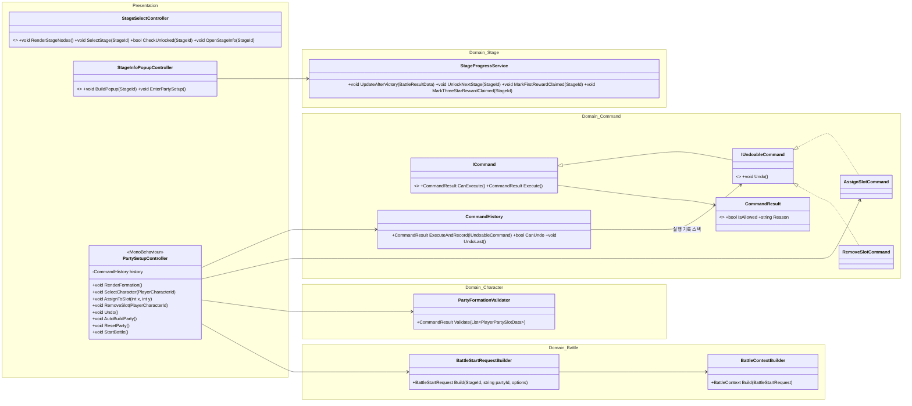
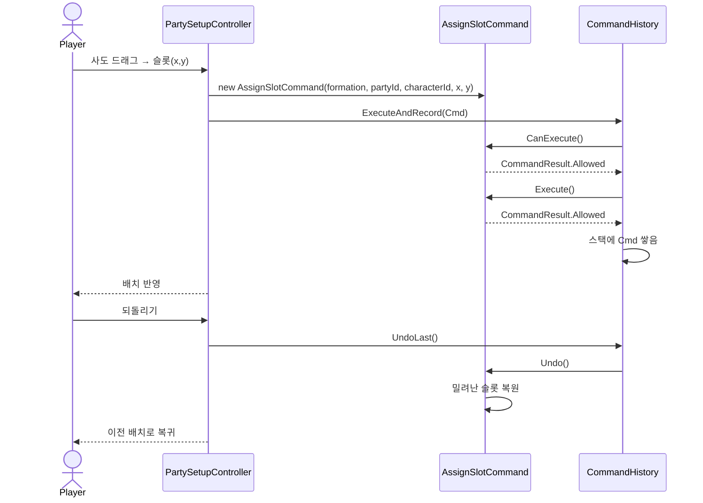
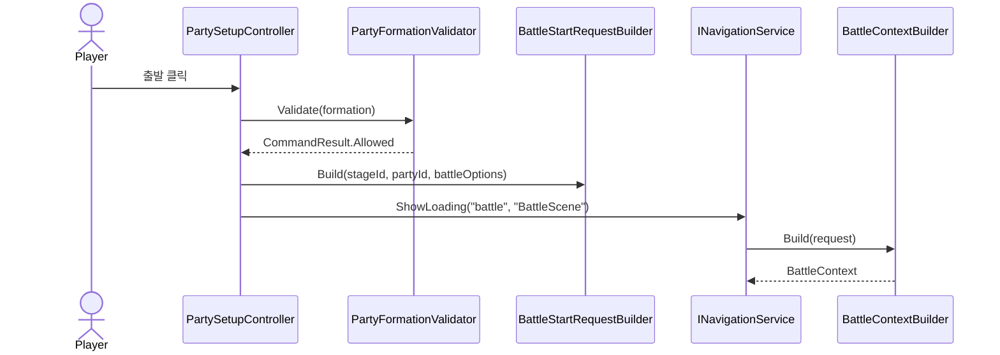

# 03. 파티편성 설계서 (스테이지 선택 · Command 패턴)

> 작성 기준일: 2026-08-03
> 문서 성격: Before 계승 + 미룬 항목 완성. 근거: `Command패턴_설계서.md`, `아키텍처_설계서.md` §2(`PartySetupController` 외), `구조개선_적용계획.md` §7, `전체_기획서.md` §3
> 공통 기반(Repository DIP)은 `09_공통기반_설계서.md`, 전투 진입 이후는 `04_전투_설계서.md` 참고.

## 0. 범위

스테이지 선택 → 파티 편성 → 전투 시작 요청 조립까지. 파티 슬롯 배치의 되돌리기(Command 패턴)와 스테이지 진행 상태 갱신이 이 문서의 핵심이다.

## 1. 클래스 구조



## 2. Command 패턴 — 파티 슬롯 배치

**개선 근거:** 파티 편성 조작을 물건(커맨드)으로 만들어 되돌리기를 지원한다. 성장 계열 커맨드(레벨업 등)는 `06_사도성장_설계서.md`에서 같은 `ICommand`/`IUndoableCommand`/`CommandResult`/`CommandHistory` 기반을 재사용한다 — 이 문서에서 그 공통 기반을 정의한다.

| 클래스 | 되돌리기 | 비고 |
|---|---|---|
| `AssignSlotCommand` | ✅ | 슬롯 배치. 밀려난 슬롯(같은 캐릭터/같은 좌표)을 실행 전 상태로 보관 |
| `RemoveSlotCommand` | ✅ | 슬롯 해제. 제거한 슬롯을 보관 |
| (`06`) `LevelUpCommand`/`PromoteCommand`/`SkillLevelUpCommand` | ❌ | 재화가 얽혀 되돌리기 위험 — `ICommand`만 구현, `Undo()` 자체가 타입에 없음 |

**`ICommand`/`IUndoableCommand`를 나눈 이유:** 되돌릴 수 없는 커맨드에 `Undo()`를 넣고 안에서 예외를 던지는 대신, **애초에 그 메서드가 없는 타입**으로 만들어 "이건 되돌릴 수 없다"를 컴파일 타임에 못박는다.

```csharp
// AssignSlotCommand.Execute() 핵심
var displaced = formation.Where(s => s.PlayerCharacterId == characterId || (s.PosX == x && s.PosY == y)).ToList();
formation.RemoveAll(s => displaced.Contains(s));
formation.Add(new PlayerPartySlotData { PlayerCharacterId = characterId, PosX = x, PosY = y });
_displaced = displaced; // Undo용 보관
```

`CommandHistory.ExecuteAndRecord(command)`가 실행과 기록을 한 번에 처리해, `CanExecute` 실패 시 히스토리에 안 쌓이게 한다.

**완성 항목 — 화면 배선.** Before는 이 Command 세트를 Domain 레이어에 만들기만 하고 `PartySetupController`가 실제로 쓰게 배선하지 않았다(단위 테스트로만 검증). 이번 설계는 `PartySetupController.AssignToSlot`/`RemoveSlot`이 `formation` 리스트를 직접 mutate하는 대신 `CommandHistory.ExecuteAndRecord(new AssignSlotCommand(...))`를 호출하도록 확정하고, 화면에 **되돌리기 버튼**(`Undo()` → `history.UndoLast()`)을 추가한다.

## 3. 스테이지 진행 — `StageClearedEvent` 발행 완성

`09_공통기반_설계서.md` §3.2가 이 문서로 위임한 이벤트다. `StageProgressService`는 Before에서 전부 스텁이었다.

```
StageProgressService.UpdateAfterVictory(BattleResultData result)
├ PlayerStageProgressData 갱신 (IStageProgressRepository)
├ result.StarCount(04_전투_설계서.md §6의 별 조건 규칙으로 계산된 값)를 기준으로
│  progress.Star1(2★ 달성 여부)과 progress.Star2(3★ 달성 여부)를 각각 독립 갱신
│  — 이미 달성(true)한 별은 이번 결과가 그 별에 미달해도 false로 되돌리지 않는다(모노토닉 누적)
├ 3별(Star1 && Star2) 달성 시 UnlockNextStage(result.StageId)
└ eventBus.Publish(new StageClearedEvent(result.StageId, starCount))  ← 신규
```

**갱신 규칙(확정, 결정 2026-08-03):** "최고 기록 갱신"은 결국 "이번 결과로 별 개수가 이전 저장값보다 높아졌을 때만 반영"과 같은 결과다 — 미달성 항목이 이번에 달성으로 바뀌면 그 항목만 `true`로 바뀌고, 이미 딴 별은 다음 판에서 못 따더라도 유지된다. `is_cleared`(1★ 해당)는 `UpdateAfterVictory` 호출 자체가 승리 결과라는 뜻이라 항상 `true`로 갱신한다.

`StageSelectController`가 `StageClearedEvent`를 구독해 스테이지 노드의 잠금/별 표시를 즉시 갱신한다 — 결과 화면에서 로비를 거쳐 스테이지 목록으로 돌아왔을 때 데이터를 다시 읽지 않아도 된다.

## 4. 시퀀스 다이어그램

### 4-1. 파티 슬롯 배치 + 되돌리기



### 4-2. 전투 시작 요청 조립 (계승)



## 5. 완성 요약

| 항목 | Before 상태 | 이번 완성 |
|---|---|---|
| `ICommand`/`IUndoableCommand`/`AssignSlotCommand`/`RemoveSlotCommand`/`CommandHistory` | 완료(단위 테스트만) | 계승 |
| `PartySetupController`가 Command를 실제로 사용 | 미배선(직접 mutate 유지) | **완성** — Command 경유 + 되돌리기 버튼 |
| `StageProgressService` 실제 구현 + `StageClearedEvent` | 스텁 | **완성** |
