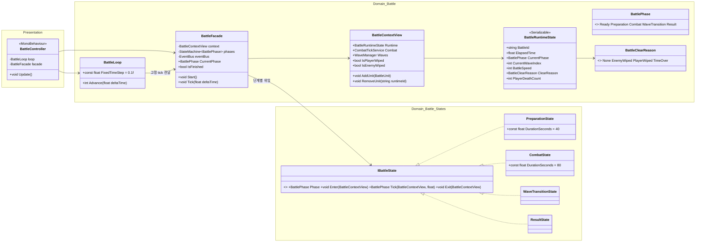
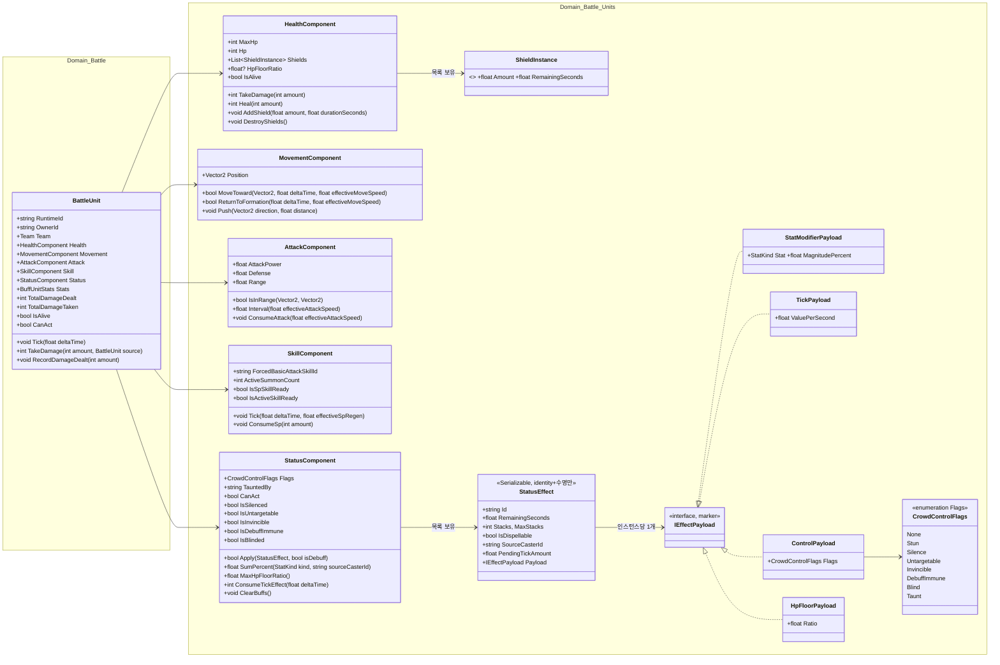
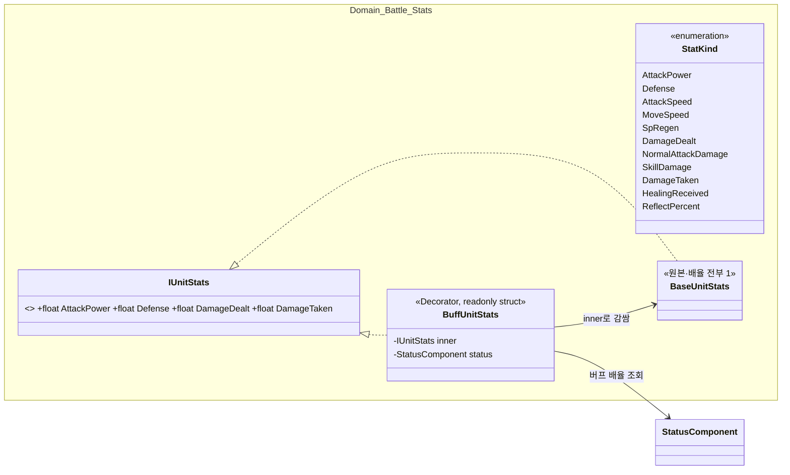
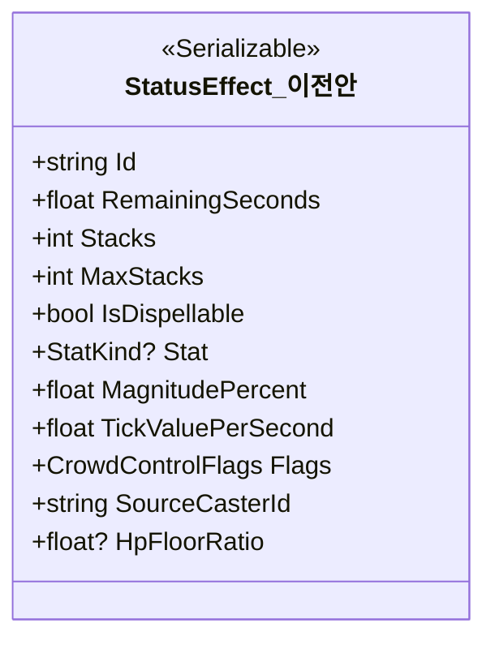
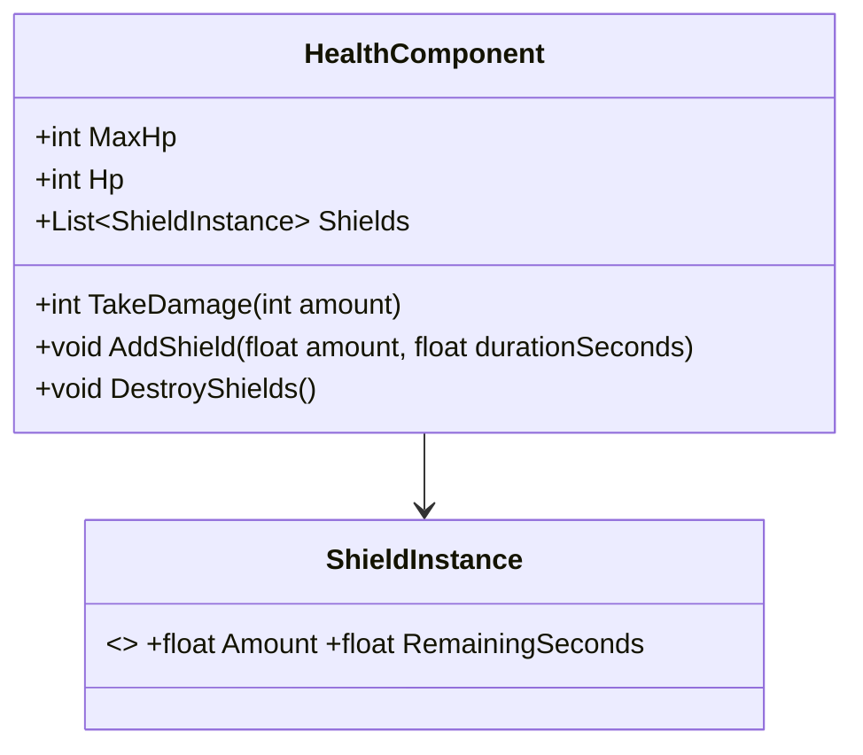
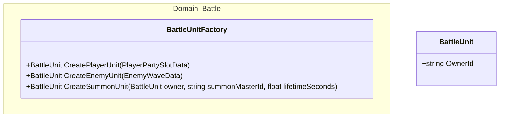
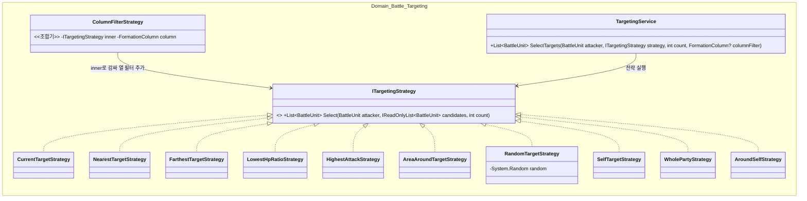
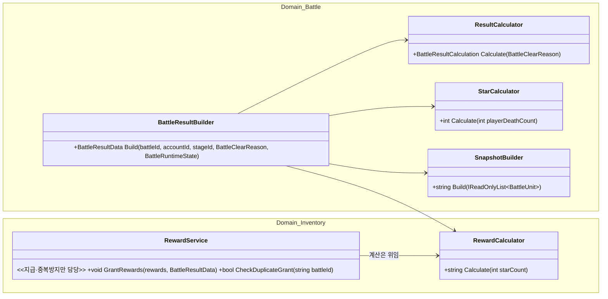
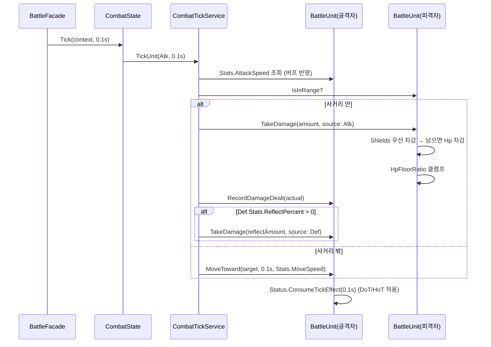
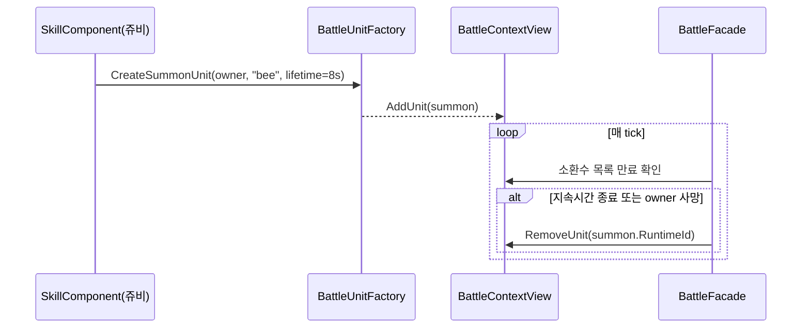

# 04. 전투 설계서 (State · Component · Decorator · Strategy · BattleResult)

> 작성 기준일: 2026-08-03
> 문서 성격: Before가 검증 완료한 전투 재구성(State/Component/Strategy, EditMode 테스트 다수 통과)을 계승하고, "화면이 없어 미룬" 항목과 "다음 단계로 남겨둔" 버프/디버프 23종을 이번에 완성한다.
> 근거 문서: `구조개선_적용계획.md` §1·§3·§4·§5·§6·§13, `클래스다이어그램_개선반영_설계도.md` §1·§2·§3·§10, `클래스다이어그램_수정_260801.md` §2-1·2-3·2-4·2-8·3-1~3-4, `버프데코레이터_설계서.md`, `BattleResultBuilder분리_설계서.md`, `사도_스킬_목록.md` §6~§8
> 공통 기반(DI/EventBus/StateMachine)은 `09_공통기반_설계서.md` 참고.

## 0. 범위

전투 화면 전체 — 웨이브 진행, 유닛 이동·공격, 버프/디버프, 액티브 스킬, 자동전투, 전투 결과 산출까지. 트릭컬 전체 컨텐츠 중 **가장 규모가 크고, 상급자 리뷰 10건 중 절반 이상(1·4·5·10번)이 이 화면에 몰려 있다.**

## 1. 3층 분리 + State 패턴

**개선 근거:** `BattleController`가 화면·시계·지휘를 전부 담당하던 God Object(나가는 화살표 10개)를 3층으로 나눈다.



| 클래스 | 종류 | 책임 |
|---|---|---|
| `BattleController` | MonoBehaviour | 화면만. `Update`를 `BattleLoop`에 흘리고 상태를 읽어 그린다 |
| `BattleLoop` | 순수 C# | 시계. 프레임 시간을 100ms로 잘라 `BattleFacade`에 넘긴다 |
| `BattleFacade` | 순수 C# | 지휘. 현재 `IBattleState`에 tick을 위임하고 전이를 판단한다. 계산은 하지 않는다 |

**핵심 설계 포인트:** `PreparationState`에는 전투 tick·액티브 스킬 코드가 **존재하지 않는다**. "준비 단계에는 스킬이 나가면 안 된다"는 규칙을 `if`로 막는 대신, 그 코드를 안 넣어서 위반을 구조적으로 불가능하게 만든다. 배속을 곱하는 곳도 `CombatState` 한 곳뿐이라, "준비 단계는 배속 무관 1배"(`전체_기획서.md` §4.1) 규칙이 구조로 지켜진다. `BattleLoop`/`BattleFacade`가 유니티를 모르므로 **에디터를 켜지 않고 5웨이브를 끝까지 돌리는 순수 C# 테스트가 가능**하다 — 이 설계 전체의 검증 전략이 여기 의존한다.

`BattleContextView.AddUnit`/`RemoveUnit`은 이번에 추가한 메서드다(§4.6 소환수 설계에서 사용). Before의 `BattleContextView`는 전투 시작 시점에 고정된 유닛 목록만 가정했는데, 소환수는 전투 도중 유닛이 늘어나야 하므로 필요하다.

## 2. 유닛 컴포넌트 분리

**개선 근거:** 필드 13개·메서드 7개짜리 `BattleUnit`을 부품 단위로 분리한다.



전부 **순수 C#**이다 — `MonoBehaviour`로 만들면 §1에서 확보한 "유니티 없이 테스트" 이점이 사라진다. 부품끼리는 서로를 참조하지 않고, 죽었을 때 이동·공격을 멈추는 등의 **조율은 `BattleUnit`(코디네이터)만 담당**한다.

**이번 완성분(§4에서 상세):** `HealthComponent.Shields`/`AddShield`/`DestroyShields`, `HpFloorRatio`, `MovementComponent.Push`, `SkillComponent.ForcedBasicAttackSkillId`/`ActiveSummonCount`/`ConsumeSp`, `StatusComponent.Flags`/`TauntedBy`/`IsUntargetable`/`IsDebuffImmune`/`IsBlinded`/`ClearBuffs`, `StatusEffect.Flags`/`SourceCasterId`/`HpFloorRatio`, `CrowdControlFlags` enum, `BattleUnit.OwnerId`(소환수용), `TakeDamage(int, BattleUnit source)`(반사용) — 전부 Before가 "다음 단계"로 미룬 자리를 채우는 확장이며, 기존 필드·메서드는 시그니처를 유지한다.

**사도 사망 집계(신규, §6 별 조건 판정용):** `HealthComponent.TakeDamage`가 `Hp`를 0으로 만드는 순간(생존→사망 전이, 최초 1회만) `BattleUnit`이 이를 감지해 `Team == Player`이면 `BattleContextView.RecordPlayerDeath()`를 호출하고, 이 호출이 `BattleRuntimeState.PlayerDeathCount`를 1 증가시킨다. 부활 메커니즘이 없는 프로젝트라 "사망 횟수 = 죽은 유닛 수"로 단순 카운트하면 된다.

## 3. 스탯 Decorator — 기본 구조 (계승)



- **가산형 확정:** `최종 = 기본 × (1 + Σ버프%)`. 버프 %끼리 먼저 합산 후 기본값에 한 번만 곱한다(`사도_스킬_목록.md` §6.4에서 원작 데이터로는 확정 불가해 이 프로젝트가 직접 정한 값).
- **Decorator 인스턴스는 버프 개수만큼이 아니라 `BuffUnitStats` 하나가 활성 버프 목록을 합산**한다. 가산형이라 N개를 개별 껍데기로 쌓는 것과 수학적으로 동일하며, 버프가 도중에 만료돼도 체인을 재조립할 필요가 없다.
- **`readonly struct`인 이유:** 전투 tick 10Hz × 유닛 60명. class면 초당 최대 600개 힙 할당이 생긴다.
- **`ReflectPercent`는 이번에 추가한 `StatKind`**(§4.4 피해반사).

### 3.1 기본 데미지 공식 (확정, 결정 2026-08-04)

`DamageCalculator`가 실제로 무엇을 계산하는지는 이 문서가 처음 작성될 때 정의되지 않은 채 남아 있었다 — 몬스터 HP를 역산(`12_몬스터스탯스킬_설계서.md` §3)하면서 발견된 공백이다. 이번에 확정한다.

```text
hit_damage = max(1, attacker.Attack × skill_coefficient - defender.Defense)
```

**감산형**이다 — 방어력이 공격력×계수를 넘어서면 최소 피해 1로 바닥을 친다(무한 방어는 없다). `Attack`/`Defense`는 `BuffUnitStats`가 계산한 최종값(레벨 성장·성급 배율·버프 전부 반영 후)을 쓴다. §3의 `Stats.DamageDealt`/`Stats.NormalAttackDamage`/`Stats.SkillDamage`/`defender.Stats.DamageTaken` 배율(가산형, §3 위 항목)은 이 `hit_damage` 결과값에 **추가로** 곱해지는 마지막 계층이다 — 계산 순서는 `(공격력 × 계수 - 방어력) × (1 + Σ피해량 버프%) × (1 + Σ받는피해 버프%)`.

이 공식은 사도-사도, 사도-몬스터, 몬스터-사도 전부에 동일하게 적용된다(양방향 대칭).

### 4.0 이번 범위

`버프데코레이터_설계서.md`가 구조화한 것은 **스탯 배율형 11종 + DoT 2종(중독·쓰라림)** 뿐이었다. 나머지 **23종**(보호막·회복·소환수·피해반사·거대화 등 복합·관계형 효과)을 이번에 완성한다. `사도_스킬_목록.md` §6.2·§6.3이 조사한 34종 전체를 아래처럼 분류해, **새 클래스 계층을 만들지 않고** `StatusEffect`가 "무엇을 하는지"(payload)만 갈아끼우는 방식으로 수렴시켰다 — Before가 세운 원칙("복합 버프는 서브클래스가 아니라 `StatusEffect` 여러 개 동시 등록")을 그대로 확장 적용한다.

`StatusEffect` 자체는 **처음부터 `IEffectPayload`로 분리한다**(결정 2026-08-03 — 필드가 늘어난 뒤 나중에 쪼개는 대신 이번에 바로 적용). §4.2에서 상세를 다룬다.

### 4.1 분류 — 7개 처리 경로로 수렴

| 처리 경로 | 대상(34종 매핑) | 메커니즘 |
|---|---|---|
| **A. 스탯 배율(기존)** | 공격력증가, 모든방어력감소, 공속증가, 감전, SP회복, 피해량증가, 물리피해량증가\*, 소음, 일반공격피해량증가, 스킬피해량증가, 받는피해량감소, 쓰라림(배율부) | `StatModifierPayload(Stat, MagnitudePercent)` → `BuffUnitStats.SumPercent` |
| **B. 틱 효과(부호 통합)** | 중독(DoT), 쓰라림(DoT), 늑대표식(DoT), **회복/HoT(신규)** | `TickPayload(ValuePerSecond)` 부호로 방향 구분 — 양수=DoT, 음수=HoT. `StatusComponent.ConsumeTickEffect` 하나로 통합 처리 |
| **C. 보호막(신규)** | 보호막 | `HealthComponent.Shields : List<ShieldInstance>` — `StatusEffect`가 아니라 `HealthComponent` 자체 목록. 지속시간 있는 별도 값 소모형이라 스탯 합산과 다른 소비 규칙(피해 시 우선 차감) |
| **D. 행동 제어 플래그(신규)** | 기절, 넉백(순간), 침묵, 눈가림, 도발, 출전금지, 무적, 디버프면역 | `ControlPayload(CrowdControlFlags)` 비트마스크 하나로 8종을 표현. `StatusComponent`가 플래그 OR 집계 |
| **E. 관계형 효과(신규)** | 심판(캐스터 한정 피해감소), 도발(TauntedBy = 강제 대상) | `StatusEffect.SourceCasterId`(payload와 별개로 identity에 위치) — 특정 시전자 관련일 때만 채움. `SumPercent(kind, sourceCasterId)`가 필터링 |
| **F. 즉시 실행(신규, StatusEffect 아님)** | SP 감소, 보호막 파괴, 버프 해제, 인형의 의지(공격 교체) | 스킬 효과가 대상의 메서드를 1회 호출 — `ConsumeSp`/`DestroyShields`/`ClearBuffs`/`ForcedBasicAttackSkillId` 대입 |
| **G. 별도 개체(신규)** | 소환수, MVP(지연 판정) | §4.6·§4.7에서 별도 설계 |

\* 이 프로젝트는 물리/마법 구분이 없어(`버프데코레이터_설계서.md` §0) 전체(`DamageDealt`)로 흡수한다.

### 4.2 `StatusEffect` — identity/수명과 payload 분리

`StatusEffect`가 identity·스탯수치·DoT·플래그·관계형까지 겸하면 필드가 계속 늘어난다(이번 확장만으로 8개 수준). **처음부터 "누가/언제까지/몇 겹"과 "무엇을 하는가"를 분리한다.**

```
StatusEffect (identity + 수명만 — payload 종류와 무관하게 항상 존재)
├ Id : string
├ RemainingSeconds : float
├ Stacks / MaxStacks : int
├ IsDispellable : bool
├ SourceCasterId : string (nullable) — 관계형 효과(§4.5)에서만 채움, payload와 독립적으로 존재
├ PendingTickAmount : float — TickPayload 소비용 누적 버퍼(런타임 상태, payload 자체엔 안 둠)
└ Payload : IEffectPayload — 인스턴스당 정확히 1개

IEffectPayload (마커 인터페이스)
├ StatModifierPayload(StatKind Stat, float MagnitudePercent)   경로 A
├ TickPayload(float ValuePerSecond)                             경로 B
├ ControlPayload(CrowdControlFlags Flags)                       경로 D
└ HpFloorPayload(float Ratio)                                    §4.9
```

**복합 버프(중독=DoT+공격력감소, 거대화=회복+피해량+공속)는 이 구조와 자연스럽게 맞는다** — 이미 "StatusEffect 여러 개 동시 등록" 원칙(Before)을 쓰므로, 인스턴스 하나가 여러 역할을 겸할 필요가 없다. 중독을 걸 때 `TickPayload`를 가진 `StatusEffect` 1개 + `StatModifierPayload`를 가진 `StatusEffect` 1개, 총 2개를 동시에 등록한다 — 지금까지와 동일한 방식이고, 각 인스턴스가 딱 하나의 관심사만 가진다는 점만 새로 확정됐다.

`StatusComponent`의 소비 지점은 "필드가 null인지"로 걸러내던 것을 **"Payload 타입이 무엇인지"로 거르는 것**으로 바뀐다.

```csharp
// StatusComponent.SumPercent — 필드 null 체크 대신 패턴 매칭으로 필터
public float SumPercent(StatKind kind, string sourceCasterId)
{
    float sum = 0f;
    foreach (var e in _effects)
    {
        if (e.Payload is not StatModifierPayload smp || smp.Stat != kind) continue;
        if (e.SourceCasterId != null && e.SourceCasterId != sourceCasterId) continue;
        sum += smp.MagnitudePercent * e.Stacks;
    }
    return sum;
}
```

`ConsumeTickEffect`/`Flags`/`TauntedBy`/`MaxHpFloorRatio`도 같은 방식으로 `e.Payload is TickPayload`/`ControlPayload`/`HpFloorPayload`를 확인하도록 바뀐다 — 새 `StatusEffect` 서브클래스 계층(`StunEffect`, `PoisonEffect`...)을 만드는 대신 **페이로드 종류만 늘리는 방식**이라, 34종을 넘어 다음 효과(원작 어사이드 등)가 추가돼도 `IEffectPayload` 구현체 하나만 늘면 된다.

<details>
<summary>(참고, 폐기된 이전 안) 필드 하나에 다 담는 방식</summary>



위 표는 이번에 처음 나왔던 "필드 하나에 다 담는 안"이다 — 8개 필드가 한 클래스에 몰리는 형태라 채택하지 않았다. 최종안은 위 §4.2 본문의 `IEffectPayload` 분리안이다.

</details>

### 4.3 경로 C — 보호막



- `AddShield`가 새 `ShieldInstance`를 목록에 추가한다(중첩 가능 — 마에스트로 SP와 알레트 액티브가 동시에 걸리면 목록에 2개).
- `TakeDamage`는 **`Shields`가 남아있으면 오래된 것부터 차감**하고, 남은 데미지만 `Hp`에서 뺀다.
- 지속시간이 다 되면 남은 보호막 값은 그냥 사라진다(원작과 동일 — 소모 안 된 보호막이 시간 만료로 없어짐).
- `DestroyShields()`(**보호막 파괴**, 리온 액티브)는 목록을 통째로 비운다 — **전량 제거로 확정**(결정 2026-08-03).
- **빅우드 SP는 원작의 "마법 피해 전용 보호막" 효과를 채택하지 않고, 이 프로젝트에서는 처음부터 일반 보호막으로 설계를 변경한다**(결정 2026-08-03). 물리/마법 피해 구분 자체가 이 프로젝트에 없으므로(§4.1 각주), 속성 한정 보호막이라는 개념 자체를 두지 않는다 — `AddShield` 호출에 속성 필터 파라미터가 없다.

### 4.4 경로 D — 행동 제어 플래그 + 반사(경로 A의 확장)

```csharp
[Flags]
public enum CrowdControlFlags
{
    None = 0,
    Stun = 1 << 0,          // 기절 — CanAct = false
    Silence = 1 << 1,       // 침묵 — 스킬 사용 불가
    Untargetable = 1 << 2,  // 눈속임 — 타겟 후보에서 제외
    Invincible = 1 << 3,    // 무적 — 모든 피해·디버프 면역
    DebuffImmune = 1 << 4,  // 디버프 면역 — 새 디버프 적용 거부
    Blind = 1 << 5,         // 눈가림 — 자신의 일반 공격이 빗나감
    Taunt = 1 << 6,         // 도발 — TauntedBy로 강제 대상 지정
    Banished = 1 << 7,      // 출전 금지 — 행동 불가 + 타겟 대상에서도 제외(Stun|Untargetable과 다른 점: 해제 후 공격력 감소가 뒤따름)
}
```

- `StatusComponent.Flags`는 `Payload`가 `ControlPayload`인 활성 `StatusEffect` 전체의 `Flags`를 OR로 합친 값이다(`e.Payload is ControlPayload cp ? cp.Flags : CrowdControlFlags.None`을 순회 합산). `CanAct = !Flags.HasFlag(Stun) && !Flags.HasFlag(Banished)`, `IsSilenced = Flags.HasFlag(Silence)` 등으로 파생 프로퍼티를 노출한다.
- **넉백**은 지속형 상태가 아니라 **순간 효과**다 — 적용 즉시 `MovementComponent.Push(direction, distance)`를 1회 호출하고, 그 직후 짧은 행동불가(수백 ms)만 `Stun`으로 표현한다. 별도 플래그를 만들지 않는다.
- **출전 금지 해제 후 공격력 감소**는 `Banished` 플래그가 꺼지는 시점에 스킬 실행부가 별도의 `StatusEffect`(경로 A, 공격력 감소)를 새로 등록하는 것으로 처리한다 — "해제 후 부가효과"는 상태 하나가 아니라 **효과 2개의 순차 등록**으로 표현한다(§4.1의 복합 버프 원칙과 동일).
- **무적/디버프면역과 `Apply`의 관계:** `StatusComponent.Apply(StatusEffect effect, bool isDebuff)`는 `isDebuff && (Flags.HasFlag(Invincible) || Flags.HasFlag(DebuffImmune))`이면 적용을 거부하고 `false`를 반환한다(가비아 무적, 코미 디버프면역).
- **피해 반사**는 새 상태 플래그가 아니라 **경로 A(스탯)로 흡수**한다 — `StatKind.ReflectPercent`를 추가하고(§3), `CombatTickService.ResolveMoveOrAttack`이 데미지 적용 직후 `defender.Stats.ReflectPercent > 0`이면 `attacker.TakeDamage(reflectAmount, source: defender)`를 추가 호출한다. 새 클래스 없이 기존 스탯 집계 경로를 재사용한다.

### 4.5 경로 E — 관계형 효과 (심판, 도발)

`IUnitStats`는 원래 유닛 단독 스탯만 다뤘다. 심판(리온)은 "**시전자에게만** 주는 피해 감소"라 유닛 단독으로 표현이 안 된다.

```csharp
// StatusComponent
public float SumPercent(StatKind kind, string sourceCasterId)
{
    float sum = 0f;
    foreach (var e in _effects)
    {
        if (e.Payload is not StatModifierPayload smp || smp.Stat != kind) continue;
        if (e.SourceCasterId != null && e.SourceCasterId != sourceCasterId) continue; // 관계형: 출처가 다르면 미적용
        sum += smp.MagnitudePercent * e.Stacks;
    }
    return sum;
}
```

- `SourceCasterId`가 `null`이면 기존과 동일하게 **누가 공격하든 항상 적용**된다(일반 스탯 버프 전부 이 경로) — `Payload` 종류와 무관하게 `StatusEffect` 자체에 있는 필드라 어떤 payload를 쓰든 관계형 필터링이 동일하게 동작한다.
- `SourceCasterId`가 채워져 있으면 **그 시전자가 공격자일 때만** 합산에 포함된다 — 심판(리온)은 `StatModifierPayload(DamageTaken, -%)`를 가진 효과에 `SourceCasterId = 리온의 RuntimeId`를 채워 등록한다.
- `DamageCalculator`가 이미 공격자·피격자 둘 다 알고 있으므로(`CalculateDamage(attacker, defender, ...)`), `defender.Status.SumPercent(StatKind.DamageTaken, attacker.RuntimeId)` 호출로 자연스럽게 연결된다. **시그니처 변경 없이** 기존 계산 경로에 인자 하나만 추가하면 된다.
- **도발**도 같은 `SourceCasterId` 필드를 재사용한다 — `TauntedBy`는 `Payload`가 `ControlPayload(Taunt)`인 효과의 `SourceCasterId`를 그대로 노출하는 프로퍼티다. `TargetingService`는 전략을 실행하기 **전에** `attacker`의 타겟 후보 중 `TauntedBy`가 자신이 아닌 적이 있으면, 그 도발자를 우선 타겟으로 강제한다(전략을 덮어쓰는 상태 — Before 결정 계승).

### 4.6 경로 G-1 — 소환수 (쥬비)



- `CreateSummonUnit`이 소환수용 `BattleUnit`을 만든다. `OwnerId = owner.RuntimeId`, `Team = owner.Team`(아군 소환수는 아군 팀).
- 소환수는 자체 지속시간(`lifetimeSeconds`)이 다하거나 소유자가 죽으면 `BattleContextView.RemoveUnit`으로 제거된다 — 별도 상태이상이 아니라 **`BattleFacade.Tick` 루프가 매 tick 소환수 목록을 훑어 만료를 확인**하는 방식(전투 유닛 수가 60명 규모라 매 tick 순회 비용이 무시할 만한 수준).
- `SkillComponent.ActiveSummonCount`로 동시 존재 가능한 소환수 수를 제한한다(쥬비: 스킬 레벨에 따라 최대 3→10마리). 새 소환 시도 시 현재 수가 상한이면 **가장 오래된 소환수부터 제거**한다 — 확정(결정 2026-08-03).
- 소환수는 `Pool`(`09_공통기반_설계서.md` §6)로 재사용 후보다. 생성·파괴가 잦은 오브젝트라 GC 압박을 줄이는 용도.

### 4.7 경로 G-2 — MVP (지연 판정)

"5초간 피해량 1위 아군"은 **캐스트 즉시**가 아니라 **일정 시간 뒤에 결과가 정해지는** 효과라 기존 즉시 적용형 스킬 실행과 다르다.

```
SkillComponent(또는 별도 DelayedSkillEffect 목록)
└ PendingContributionCheck
    ├ startedAtDealt : Dictionary<string runtimeId, int totalDamageDealtSnapshot> (캐스트 시점 스냅샷)
    ├ evaluateAtElapsedTime : float (캐스트 시점 + 5초)
    └ 평가 시점: 각 아군의 (현재 TotalDamageDealt - 스냅샷) 중 최댓값 유닛에게 MVP 버프(복합 StatusEffect 묶음) 적용
```

- `BattleUnit.TotalDamageDealt`(§6 BattleResultBuilder에서 신설된 누적 필드)를 그대로 재사용한다 — 판정을 위한 새 집계 체계를 따로 만들지 않는다.
- `PendingContributionCheck`는 `BattleFacade`가 매 tick 확인하는 대기열에 들어간다(전투 전체에 동시 대기 1~2건 수준이라 비용 문제 없음).
- MVP 버프 자체(공속↑ + 피해량↑, 해제 불가)는 **경로 A 효과 2개를 동시 등록**하는 기존 복합 버프 원칙 그대로다 — 새로운 게 판정 지연 방식뿐이다.
- **인형의 의지(클로에)**는 이미 Before가 구조를 결정했다 — `SkillComponent.ForcedBasicAttackSkillId`(nullable)에 값이 있으면 기본 공격 실행 직전 대체 스킬로 실행한다. 이번 문서에서 실행 지점만 명시한다: `CombatTickService.ResolveMoveOrAttack`이 공격 판정 시 `attacker.Skill.ForcedBasicAttackSkillId`를 먼저 확인한다.

### 4.8 34종 최종 매핑표

| # | 효과 | 분류 | 경로 | 사용처 |
|---|---|---|---|---|
| 1 | 보호막 | 버프 | C | 마에스트로 외 7 |
| 2 | 회복(HoT) | 버프 | B(음수) | 디아나 외 8 |
| 3 | SP 회복 | 버프 | A | 캬롯 외 3 |
| 4 | 받는 피해량 감소 | 버프 | A | 캬롯 외 4 |
| 5 | 피해량 증가 | 버프 | A | 캬롯 외 3 |
| 6 | 물리 피해량 증가 | 버프 | A(흡수) | 바리에 |
| 7 | 일반 공격 피해량 증가 | 버프 | A | 클로에, 아네트 |
| 8 | 스킬 피해량 증가 | 버프 | A | 코미(수영복), 리코타 |
| 9 | 공격 속도 증가 | 버프 | A | 아네트 외 3 |
| 10 | 공격력 증가 | 버프 | A | 캬롯 |
| 11 | 무적 | 버프 | D | 가비아 |
| 12 | 디버프 면역 | 버프 | D | 코미 |
| 13 | 피해 반사 | 버프 | A(신규 StatKind) | 가비아 |
| 14 | 눈속임 | 버프 | D | 아네트 |
| 15 | 뻗대기 | 버프 | §4.9 | 코미 |
| 16 | 거대화 | 버프 | 복합(A+B 조합) | 코미 |
| 17 | 인형의 의지 | 버프 | F | 클로에 |
| 18 | MVP | 버프 | G-2 | 아네트 |
| 19 | 소환수 | 버프 | G-1 | 쥬비 |
| 20 | 기절 | 디버프 | D | 알레트 외 5 |
| 21 | 넉백 | 디버프 | D(순간) | 디아나 외 2 |
| 22 | 침묵 | 디버프 | D | 캬롯, 코미(수영복) |
| 23 | 눈가림 | 디버프 | D | 레테 |
| 24 | 감전 | 디버프 | A | 아멜리아 |
| 25 | 도발 | 디버프 | D+E | 클로에 외 2 |
| 26 | 출전 금지 | 디버프 | D | 아네트 |
| 27 | 소음 | 디버프 | A | 마에스트로 외 2 |
| 28 | SP 감소 | 디버프 | F | 디아나, 마에스트로 |
| 29 | 모든 방어력 감소 | 디버프 | A | 바나 |
| 30 | 중독 | 디버프 | A+B | 파트라 |
| 31 | 쓰라림 | 디버프 | A+B | 란 |
| 32 | 늑대 표식 | 디버프 | B+A(+조건, §4.10) | 란 |
| 33 | 심판 | 디버프 | E | 리온 |
| 34 | 보호막 파괴 | 디버프 | F | 리온 |
| — | 버프 해제 | (디버프 목록 §6.3 별항) | F | 페스타 |

### 4.9 뻗대기 — HP 하한

`HpFloorPayload(Ratio)`(예: 0.05 = 최대 HP의 5%)를 가진 `StatusEffect`를 등록하면, `HealthComponent.TakeDamage`가 결과 HP를 `Max(결과, MaxHp * MaxHpFloorRatio)`로 클램프한다. 여러 개가 겹치면 `StatusComponent.MaxHpFloorRatio()`(`e.Payload is HpFloorPayload hp`인 것들 중 `hp.Ratio` 최댓값)가 **가장 높은 값**을 반환한다 — 가장 관대한 하한이 아니라 가장 강한 보호가 이긴다(확정, 결정 2026-08-03). 현재 로스터엔 뻗대기 보유자가 코미 1명뿐이라 실제 중첩은 발생하지 않는다.

### 4.10 거대화 / 늑대표식 — 복합·조건부 효과 처리 원칙

- **거대화(코미)**: 회복 + 피해량 증가 + 공속 증가 복합. 새 클래스를 만들지 않고, 스킬 실행부가 캐스트 시점에 **`StatusEffect` 3개(HoT 1 + 스탯 배율 2)를 동시에 등록**한다. 지속시간(12초)이 셋 다 동일하므로 관리 부담이 없다.
- **늑대표식(란)**: DoT + 주는피해 감소(경로 B+A) 자체는 일반 복합 버프와 같다. "조건 만족 시 재부여"(참격이 표식 대상에게 확정 치명타 + 표식 갱신)는 **StatusEffect 구조의 문제가 아니라 스킬 조건부 계수(`combat_master.skills.conditions[]`, §8 DB 반영 참고)의 문제**다 — 스킬 실행부가 대상의 표식 유무를 확인하고 계수를 바꾸는 것으로 처리하며, 이 문서(전투 구조)의 확장 대상이 아니다.

## 5. 타겟팅 Strategy

**개선 근거:** `TargetingService`의 `if (role == "Dealer")` 식 분기를 전략 객체로 대체한다. `사도_스킬_목록.md` §6.1이 30명 데이터로 **실사용 전략을 12종으로 확정**했다 — Before의 8종 설계안에서 4종이 늘었다.



| 전략 | 대상 | 비고 |
|---|---|---|
| `CurrentTarget` | 적 | 기본 공격 대부분 |
| `Nearest` / `Farthest` | 적 | 거리 기준 |
| `LowestHpRatio` | 적·아군 겸용 | 아군/적 구분은 전략이 아니라 후보 목록 생성 시점에서 함 |
| `HighestAttack` | 적·아군 겸용 | 동일 |
| `AreaAroundTarget` | 적 | 범위기 다수 |
| `RandomTargets` | 적 | **시드 주입** — 재현 가능성 확보. 동점은 `RuntimeId` 순 |
| `Self` | 자신 | |
| `WholeParty` | 아군 전체 | |
| `AroundSelf` | 주변 아군 | |
| `ColumnFilterStrategy` | (조합기) | 바나(후열 전체), 리온(전방 전열)처럼 **열 조건이 붙는 변형**을 파라미터화 — 매 전략마다 열 버전을 따로 만들지 않는다 |

**우선순위가 붙는 변형(란의 늑대표식 대상 우선, 리온의 심판 3중첩 대상 추가타)**은 `PreferStatusStrategy`(조합기, 특정 상태이상 보유 후보를 우선 정렬)로 처리한다 — Before가 이미 설계한 조합기를 그대로 쓴다.

**한 스킬이 타겟 그룹 2개를 잡는 경우(리코타 SP, 코미(수영복) 기본 공격)**는 `TargetingService.SelectTargets`를 효과 개수만큼 여러 번 호출하는 것으로 해결한다 — 스킬 데이터의 `effects[]` 각 항목이 자기 `target_strategy`/`target_count`/`column_filter`를 갖는다(§8 DB 반영).

## 6. BattleResultBuilder 분리

**개선 근거:** 승패 판정·별 조건·전투 기록·보상 계산이 뒤섞인 `BattleResultBuilder`를 역할별로 나눈다. 리뷰 원안(4분할)을 그대로 적용하면 보상 계산이 `RewardService`와 중복되므로, `RewardCalculator`는 새로 만드는 대신 `RewardService`에서 계산 책임만 떼어내는 형태로 조정한다(Before 결정 계승).



- `BattleRuntimeState.ClearReason`(`EnemyWiped`/`PlayerWiped`/`TimeOver`)이 `CombatState.Tick()`의 세 전이 분기 각각에서 기록된다 — **이 신호가 없으면 "시간초과 패배가 승리로 오판정"되는 버그**(Before에서 실제 발견·수정됨)가 재발한다. `BattleEndedEvent`(`09_공통기반_설계서.md` §3.2)도 `!IsPlayerWiped` 근사치가 아니라 이 값을 근거로 발행한다.
- `BattleUnit.TotalDamageDealt`/`TotalDamageTaken`은 `SnapshotBuilder`(결과 화면 기여도)뿐 아니라 `04` §4.7 MVP 판정에도 재사용된다.
- **별 조건 규칙(확정, 결정 2026-08-03) — 전 스테이지 공통, 스테이지별 데이터 불필요:**

  | 별 | 조건 |
  |---|---|
  | 1★ | 스테이지 클리어(모든 몬스터 처치) — `ResultCalculator`가 `Win`으로 판정한 경우에만 별 계산 자체가 호출되므로 자동 충족 |
  | 2★ | `PlayerDeathCount <= 1` (사도가 전투 중 2번 이상 쓰러졌으면 실패) |
  | 3★ | `PlayerDeathCount == 0` (아무도 쓰러지지 않고 승리) |

  `StarCalculator.Calculate(int playerDeathCount)`가 이 규칙을 그대로 구현한다. **이 규칙은 전역 고정값이라 스테이지별 파라미터(생성자 주입 임계값이든 `StageMasterData` 파싱이든)가 필요 없다** — §8의 `stage_master` 별 조건 데이터 불일치 문제가 이 결정으로 해소된다. `ClearTimeSec`/`WaveClearCount`는 `BattleResultData`에 계속 기록하지만(결과 화면 통계 표시용), 별 계산에는 더 이상 쓰이지 않는다.

  **난이도 시스템 도입 시 재검토 대상**(이번 기획 단계 범위 밖): 난이도가 여러 단계로 나뉘면 "특정 난이도는 클리어만 하면 별 3개 만점" 같은 예외가 생길 수 있다. 그 시점에 `StarCalculator`가 난이도 값을 추가로 받는 형태로 확장한다 — 지금은 단일 난이도만 존재하므로 다루지 않는다.

- `RewardCalculator.Calculate(int starCount)`는 `stageId`를 받지 않는다 — 스테이지별 보상표(`economy_master` 연동)를 지을 근거가 아직 없어, 매개변수만 미리 만들면 미사용 매개변수가 된다.

## 7. 시퀀스 다이어그램

### 7-1. 전투 tick (버프·보호막·반사 포함)



### 7-2. 소환수 생성·만료



## 8. DB 설계 반영 필요 (참고, 이 문서 범위 밖)

이 설계가 전제하는 데이터가 `DB_설계서.md`에 아직 없다. 실제 데이터 스키마 확정은 별도 작업이며, 여기서는 필요 항목만 표로 남긴다(`사도_스킬_목록.md` §8과 동일).

| 대상 | 필요한 것 |
|---|---|
| `combat_master.buffs` | `buff_id`, `category`, `max_stack`, `duration`, `stat_modifier_json`, `is_dispellable` |
| `combat_master.debuffs` | `debuff_id`, `category`, `max_stack`, `duration`, `overrides_targeting` |
| `combat_master.skills.effects[]` | 효과별 `target_strategy`+`target_count`+`column_filter` |
| `combat_master.skills.conditions[]` | 조건부 계수(늑대표식 재부여, 리코타 조건부 배율 등) |
| `combat_master` 피해 계산 | `damage_source`(`attack`/`max_hp`) |
| `character_master` | `start_sp`, `sp_per_hit`, (선택) `active_skill_cooldown` |
| ~~`stage_master` 별 조건 필드~~ | **해소(결정 2026-08-03)** — 별 조건이 전역 고정 규칙(§6)으로 확정되어 스테이지별 데이터가 불필요해짐. `StageMasterData.StarConditions1/2`·`star_conditions_json` 필드 자체를 제거해도 됨(난이도 시스템 도입 전까지) |

## 9. 완성 요약 및 남은 미결 사항

| 항목 | Before 상태 | 이번 완성 |
|---|---|---|
| 스탯 배율 11종 + DoT 2종 | 완료 | 계승 |
| 보호막·HoT·소환수·피해반사·거대화·인형의의지(실행)·MVP 등 23종 | 다음 단계로 미룸 | **완성** — §4 |
| 타겟팅 전략 | 8종 설계 | **12종으로 확정**(§5, `사도_스킬_목록.md` 실사용 기준) |
| BattleResultBuilder 분리 + ClearReason | 완료 | 계승 |
| 유닛 기여도(`TotalDamageDealt`) | 완료 | 계승 + MVP 판정에 재사용 |
| 별 조건 규칙 | 임계값 미정(생성자 주입 자리만) | **확정**(결정 2026-08-03) — 1★클리어/2★사망1회이하/3★무사망, 전역 고정 |
| 소환수 상한 초과 처리 | 원작 미확인 | **확정**(결정 2026-08-03) — 가장 오래된 것부터 제거 |
| 보호막 파괴 범위 | 임의(전량 제거) | **확정**(결정 2026-08-03) — 전량 제거 |
| 빅우드 SP 속성 한정 보호막 | 원작 유지 시도 | **설계 변경 확정**(결정 2026-08-03) — 일반 보호막으로 대체, 속성 한정 개념 자체를 두지 않음 |
| `HpFloorRatio` 중첩 규칙 | 임의(가장 높은 값) | **확정**(결정 2026-08-03) — 여러 개 겹치면 가장 높은 값(가장 강한 보호) 채택 |
| `StatusEffect` 구조 | 필드 8개를 한 클래스에 보유(임시안) | **분리 확정 및 적용**(결정 2026-08-04) — identity/수명(`Id`/`RemainingSeconds`/`Stacks`/`MaxStacks`/`IsDispellable`/`SourceCasterId`)과 `IEffectPayload`(4종: `StatModifierPayload`/`TickPayload`/`ControlPayload`/`HpFloorPayload`)로 처음부터 분리 — §4.2 |

남은 미결 항목 없음. 착수 전 재확인이 필요한 항목은 모두 §9 표에서 확정 처리됐다.
