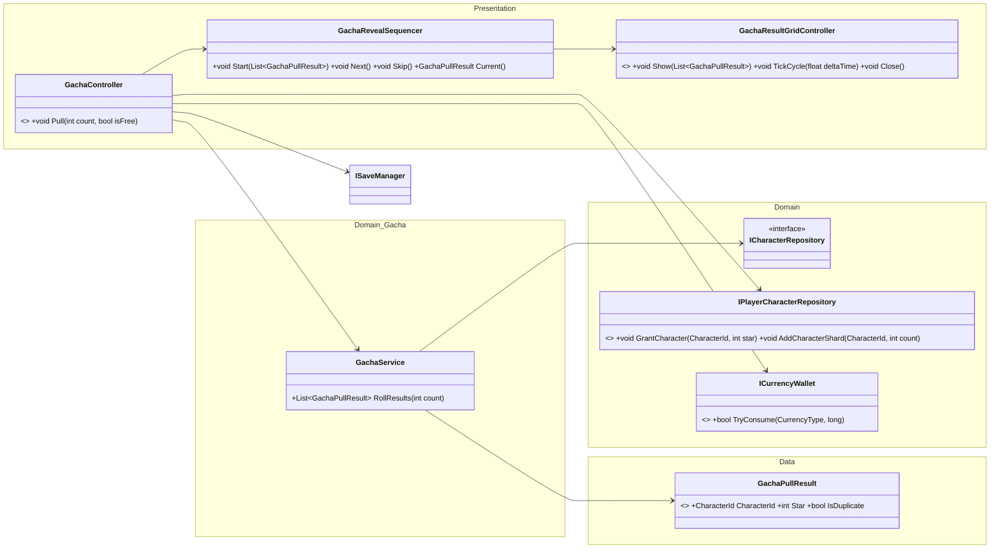
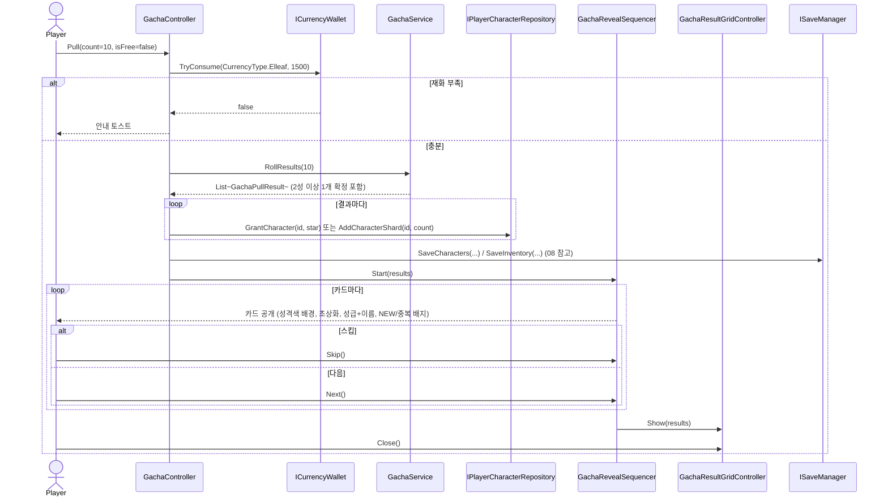

# 05. 가챠(모집) 설계서

> 작성 기준일: 2026-08-03
> 문서 성격: Before 계승 + DIP 경계 완성. 근거: `아키텍처_설계서.md` §2(모집 관련 신규 클래스), §4(모집 시퀀스), `전체_기획서.md` §5
> 공통 기반(Repository DIP)은 `09_공통기반_설계서.md` 참고.

## 0. 범위

모집(가챠) 배너 1종, 1/10연 뽑기, 카드 공개 연출, 결과 그리드. `전체_기획서.md` §5의 확률·연출 규칙은 바꾸지 않는다.

## 1. 클래스 구조



| 클래스 | 책임 |
|---|---|
| `GachaController` | 화면. 재화 확인·차감, 뽑기 실행, 연출 시작 |
| `GachaService` | 계산만. 확률 롤·중복 판정을 연출과 분리해, 나중에 연출만 바꿔도 계산 로직에 영향이 없다 |
| `GachaRevealSequencer` | 카드 공개 연출(클릭 진행, 스킵) |
| `GachaResultGridController` | 결과 그리드 연출(중복 카드 크로스페이드) |

## 2. 완성 항목 — Repository DIP 경계 적용

Before의 원본 시퀀스(`아키텍처_설계서.md` §4)는 `GachaController → PlayerDataRepository`로 **구체 클래스**를 직접 참조했다. `09_공통기반_설계서.md`가 확정한 DIP 원칙을 이 화면에도 동일하게 적용해, `ICurrencyWallet`(재화 차감)과 `IPlayerCharacterRepository`(사도 지급·조각 지급)로 좁힌다 — `GachaController`는 파티·스테이지진행도 등 자신과 무관한 데이터에 접근할 수 없게 된다.

```
변경 전: GachaController → PlayerDataRepository (구현체, 전체 접근 가능)
변경 후: GachaController → ICurrencyWallet + IPlayerCharacterRepository (실제 쓰는 것만)
```

## 3. 시퀀스 다이어그램 (계승, 인터페이스 경계만 갱신)



## 4. 기획 범위 확인 (변경하지 않음)

`전체_기획서.md` §5가 "한 번 더 뽑기" 버튼을 "참고 화면에는 있으나 이번 세션 구현 범위 밖"으로 명시했다 — 이는 아키텍처 미룸이 아니라 **게임 기획 결정**이므로 이번 설계 완성 대상에 포함하지 않는다. 필요해지면 `GachaController.Pull`을 결과 화면에서 재호출하는 것으로 충분해, 구조 변경 없이 추가 가능하다.

## 5. 완성 요약

| 항목 | Before 상태 | 이번 완성 |
|---|---|---|
| `GachaController`/`GachaService`/`GachaRevealSequencer`/`GachaResultGridController` | 완료 | 계승 |
| DIP 경계(구체 리포지토리 → 인터페이스) | `PlayerDataRepository` 직접 참조 | **완성** — `ICurrencyWallet`+`IPlayerCharacterRepository`로 좁힘 |
