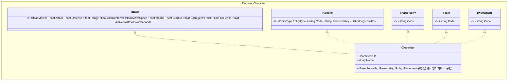
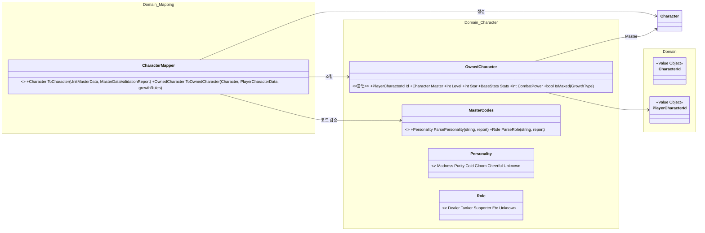
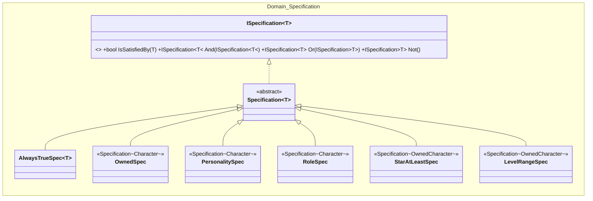
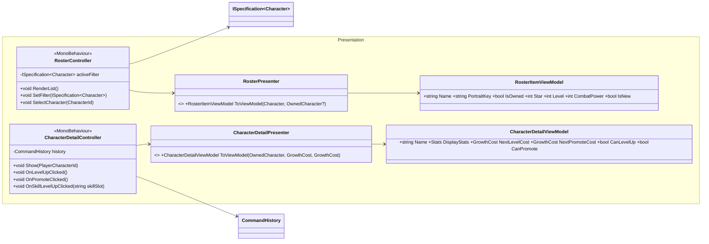
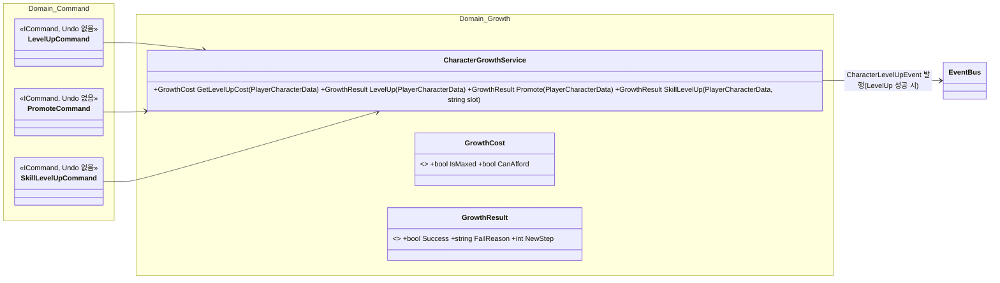

# 06. 사도·성장 설계서 (로스터 · 성장 · Specification)

> 작성 기준일: 2026-08-03
> 문서 성격: Before 계승 + 미룬 항목 완성. 근거: `Specification패턴_설계서.md`, `구조개선_적용계획.md` §11·§12, `클래스다이어그램_수정_260801.md` §2-6·2-7, 메모리 `character_composition_design`, `전체_기획서.md` §6
> 공통 기반(Repository DIP)은 `09_공통기반_설계서.md`, Command 공통 기반은 `03_파티편성_설계서.md` §2 참고.

## 0. 범위

사도 도메인 모델(마스터 원본 + 보유·성장 상태), 로스터 화면, 사도 상세 화면(레벨업/승급/스킬레벨업), 로스터 필터.

## 1. 캐릭터 합성 아키텍처 (계승)

과거 그릴링 세션(2026-07-27)에서 확정된 5-인터페이스 합성 구조를 그대로 계승한다 — 사도든 몬스터든 `UnitMasterData`(`04_전투_설계서.md` 참고)를 같은 방식으로 해석하는 진입점이다.



- 각 컴포넌트는 자기 영역만 갖는다(상호 의존 없음). `Character`는 생성 후 불변이다.
- `IPersonality`/`IRole`/`IPlacement`는 **원본 코드 문자열(`Code`)을 그대로 노출**한다 — enum은 이 문자열을 나중에 해석하는 별도 계층(§2)이며, `Character` 자체가 enum 필드를 갖지는 않는다. 이는 과거 "enum 파싱 없이 string 유지" 결정과 이후 "enum + `Unknown` fallback" 결정이 실제로는 **충돌하지 않는 이유**다 — 저장/합성 계층은 문자열을 유지하고, enum은 소비 지점(`MasterCodes`)에서만 파생된다.
- **`IBase` 필드 갱신 이력:** (2026-08-04 1차) `Speed`(이동속도) 필드를 제거하고 `Range`/`AttackInterval`(개별 전투 스탯), `StartSp`/`SpPerHit`(원작 조사로 확인된 누락 필드, `사도_스킬_목록.md` §7-4), `ActiveSkillCooldownSeconds`(사도별 원작값 채택, `10` §3·§6)를 추가했었다. (2026-08-04 2차, 정책 재변경) 이동속도를 "전체 유닛 공통 고정값"으로 강제한 것이 몬스터 디버프(감전) 설계에서 발목을 잡아 — `MoveSpeed`를 **개별 필드로 복원**하고, 전역값은 "기준값(디폴트)"으로만 격하했다(`10` §1.4). `CharacterMapper`가 `base_stats_json`의 12개 필드(기존 9개 + `start_sp`/`sp_per_hit` + `move_speed` 개별화)를 이 인터페이스로 매핑한다.

## 2. Mapper · Value Object · `OwnedCharacter` (계승)



- `Character`는 `UnitMasterData`도 `JsonUtility`도 모른다 — 파싱은 전부 `CharacterMapper`가 한다.
- `OwnedCharacter`(마스터 원본 + 레벨·성급·스킬레벨 + 계산된 최종 스탯·전투력)는 불변이라 레벨업하면 새로 만든다 — `EventBus` 갱신(§5)과 잘 맞는다(참조를 들고 있어도 자동 최신화되지 않으므로, 이벤트로 재조회를 트리거하는 흐름이 명확하다).
- `CombatPower`는 저장하지 않는다(밸런스 패치로 마스터가 바뀌면 낡은 값이 남는 문제) — 조회 시점에 매번 계산한다.
- 모르는 마스터 코드는 예외 대신 `Unknown` + `MasterDataValidationReport`(로드 직후 경고 로그)로 처리한다.

## 3. Specification — 로스터 필터



`T`가 스펙마다 다르다 — 보유 여부·성격·역할은 마스터(`Character`)만으로 판단 가능하지만, 성급·레벨은 보유해야만 존재하는 값이라 `OwnedCharacter`를 대상으로 한다. `Specification<T>`가 `And`/`Or`/`Not`을 한 번만 구현해 5개 구체 스펙은 `IsSatisfiedBy`만 채우면 조합 기능을 얻는다.

## 4. 완성 항목 — 로스터·상세 화면 + ViewModel

Before는 소비 화면이 없다는 이유로 `RosterController`/`CharacterDetailController`와 ViewModel 계층 전체를 개념설계로만 남겼다. 이번엔 실제로 채운다.



- **ViewModel 생성은 static Presenter가 담당**한다(`09_공통기반_설계서.md` §4가 정한 공통 원칙 — Mapper와 같은 성격의 "통역만" 하는 계층). 컨트롤러는 Presenter를 호출해 화면에 필요한 형태만 받는다.
- `RosterController`는 미보유 사도를 실루엣으로 표시한다(`RosterItemViewModel.IsOwned == false`) — 클릭 시 `CharacterDetailController.Show`를 호출하지 않고 안내만 띄운다(`전체_기획서.md` §6 규칙 유지).
- `CharacterDetailController`는 `06`의 성장 Command(아래 §5)를 `CommandHistory`(`03_파티편성_설계서.md`에서 정의한 공통 기반)로 실행한다.

## 5. 성장 Command 완성 — 화면 배선



성장 Command는 `Undo()`가 없는 `ICommand`만 구현한다(재화 환불 위험, `03` §2 결정과 동일 원칙). `CanExecute()`가 `growthService.GetLevelUpCost(save)`를 물어 `IsMaxed`/`CanAfford`로 판단하고, `Execute()`가 `GrowthResult`를 `CommandResult`로 변환해 돌려준다.

**완성 항목 — 화면 배선.** Before는 이 3개 Command를 Domain 레이어에 만들기만 하고 소비 화면이 없어 아무도 안 불렀다. 이번엔 `CharacterDetailController.OnLevelUpClicked()` 등이 실제로 `history.ExecuteAndRecord(new LevelUpCommand(...))`를 호출하도록 확정한다. 성공 시 `CharacterGrowthService`가 `CharacterLevelUpEvent`를 발행하고(`09` §3.2), `RosterController`가 이를 구독해 정렬(전투력 기준)을 갱신한다.

## 6. 완성 항목 — 필터 프리셋 저장

Before는 "화면(`RosterController`)이 없어 저장/불러오기 둘 다 쓸 곳이 없다"는 이유로 미뤘다. 이번엔 화면이 설계됐으므로 완성한다.

```
player_filter_preset.json (신규 세이브 파일, 08_저장_설계서.md에 핸들러 추가)
└ List<FilterPresetData>
    ├ presetId, name
    └ conditionTree : json  (PersonalitySpec/RoleSpec/StarAtLeastSpec 조합을 트리로 직렬화)

FilterPresetSerializer (신규, Domain/Specification/)
├ Serialize(ISpecification<Character>) : string
└ Deserialize(string) : ISpecification<Character>
```

조건 트리는 `{ "type": "And", "left": {...}, "right": {...} }` 형태의 JSON으로 직렬화한다. 각 리프 노드(`PersonalitySpec` 등)는 자기 타입 이름 + 생성자 인자만 담으면 되므로, `Specification<T>` 계층 자체를 건드리지 않고 **직렬화 전용 어댑터 하나**로 해결한다.

## 7. 완성 요약

| 항목 | Before 상태 | 이번 완성 |
|---|---|---|
| 5-인터페이스 캐릭터 합성 | 완료 | 계승 |
| `CharacterMapper`/`OwnedCharacter`/Value Object | 완료 | 계승 |
| `ISpecification<T>` 5종 | 완료(단위 테스트만) | 계승 |
| `RosterController`/`CharacterDetailController` | 개념설계(이름만) | **완성** |
| ViewModel 계층(`RosterItemViewModel`/`CharacterDetailViewModel`/Presenter) | 미착수 | **완성** |
| `LevelUpCommand`/`PromoteCommand`/`SkillLevelUpCommand` 화면 배선 | 미배선 | **완성** |
| 필터 프리셋 저장 | 미착수 | **완성** |
