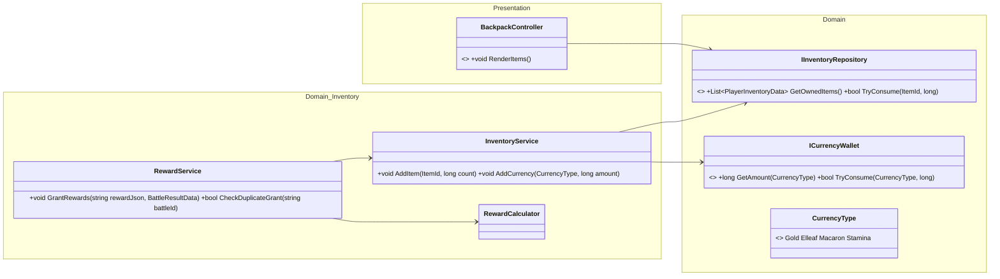
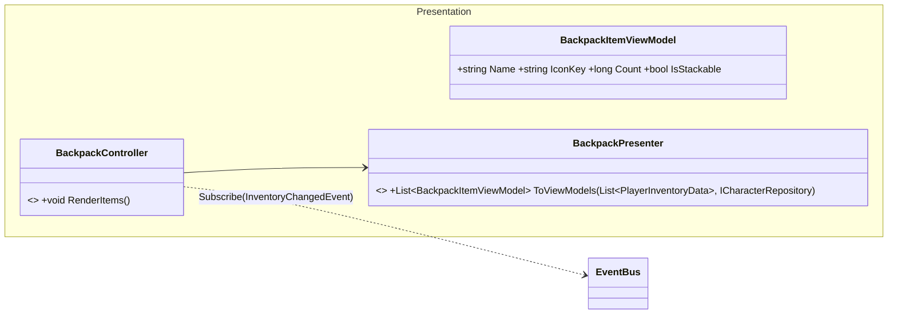
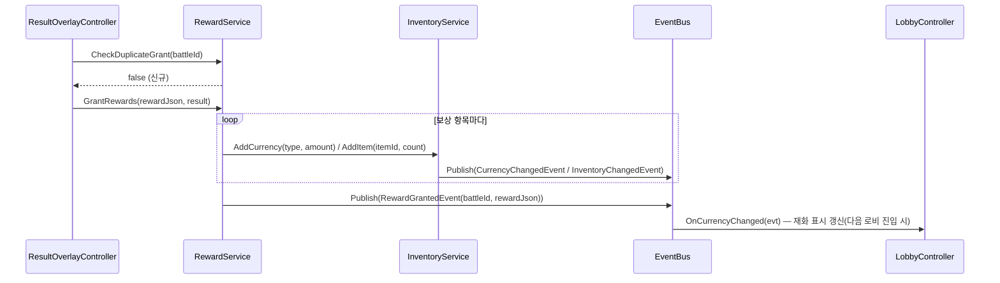

# 07. 인벤토리·재화 설계서 (배낭 · 보상 지급)

> 작성 기준일: 2026-08-03
> 문서 성격: Before 계승 + 미룬 항목 완성. 근거: `BattleResultBuilder분리_설계서.md`, `EventBus배선_설계서.md`, `DB_설계서.md` §3.3·§4.5, `전체_기획서.md` §3·§7
> 전투 결과 계산(`RewardCalculator`)은 `04_전투_설계서.md` §6에서 이미 설계했다 — 이 문서는 지급·소비·화면을 다룬다.

## 0. 범위

재화(골드/엘리프/마카롱/행동력)와 수량형 아이템(티켓/조각) 관리, 배낭 화면, 전투 보상의 실제 지급.

## 1. 클래스 구조



`InventoryService`는 `IInventoryRepository`(수량형 아이템)와 `ICurrencyWallet`(재화)을 모두 다룬다 — `DB_설계서.md` §3.1/§3.3이 재화와 아이템을 별도 파일(`account_save`/`player_inventory_save`)로 나눴으므로, 인터페이스도 그 경계를 그대로 따른다.

## 2. 완성 항목 — `InventoryService`/`RewardService` 실제 구현 + 이벤트 발행

Before는 이 둘을 전부 `NotImplementedException` 스텁으로 남겼다(발행할 이벤트 자체가 스텁이라는 이유로 `09` §3.2가 4개 이벤트를 미룬 근본 원인). 이번엔 완성한다.

```
InventoryService.AddCurrency(currencyType, amount)
├ ICurrencyWallet에 반영(누적)
└ eventBus.Publish(new CurrencyChangedEvent(currencyType, newAmount))   ← 신규

InventoryService.AddItem(itemId, count)
├ IInventoryRepository에 반영(누적, 아이템 종류별 레코드)
└ eventBus.Publish(new InventoryChangedEvent(itemId, newCount))         ← 신규

RewardService.CheckDuplicateGrant(battleId)
└ IStageProgressRepository/BattleResultSaveHandler(08)의 누적 리스트에서 battleId 존재 여부 확인

RewardService.GrantRewards(rewardJson, result)
├ CheckDuplicateGrant 통과 확인(호출부 책임 — 04의 시퀀스 §3-1 alt 분기와 동일 규칙)
├ rewardJson 파싱 → 항목별 InventoryService.AddItem/AddCurrency 호출
└ eventBus.Publish(new RewardGrantedEvent(result.BattleId, rewardJson)) ← 신규
```

세 이벤트(`CurrencyChanged`/`InventoryChanged`/`RewardGranted`)는 `09_공통기반_설계서.md` §3.2가 이 문서로 위임한 항목이다. 로비 재화 표시, 배낭 화면, 사도상세(승급 버튼의 조각 보유량 표시)가 이 이벤트를 구독해 갱신한다.

## 3. 배낭 화면



전용 조각(`character_shard`)은 `PlayerInventoryData.CharacterId`가 채워진 레코드다 — `BackpackPresenter`가 `ICharacterRepository`로 대상 사도 이름·아이콘을 조회해 표시용 이름을 채운다(`economy_master.items`가 `item_type`만 정의하고 표시 이름은 사도 마스터를 따라가야 하는 항목은 이렇게 처리).

**상점 화면은 이번 완성 대상이 아니다.** `DB_설계서.md` §4.5.4(`shop_products`)에 데이터 스키마는 있지만 `전체_기획서.md` §3 화면 흐름표에 상점이 없다 — 이는 아키텍처 미룸이 아니라 **아직 확정되지 않은 게임 기획 범위**이므로, `구조개선_적용계획.md` §0 전제("게임플레이 기획 범위는 고정")에 따라 이번 설계에 포함하지 않는다. 상점이 기획에 추가되면 `ICurrencyWallet`/`IInventoryRepository`/`CurrencyChangedEvent` 구독이라는 동일한 패턴을 그대로 재사용할 수 있다.

## 4. 시퀀스 다이어그램 — 보상 지급



## 5. 완성 요약

| 항목 | Before 상태 | 이번 완성 |
|---|---|---|
| `InventoryService`/`RewardService` 실제 구현 | 스텁 | **완성** |
| `CurrencyChanged`/`InventoryChanged`/`RewardGranted` 이벤트 | 미룸(발행처 스텁) | **완성** |
| `BackpackController` | 개념설계(이름만) | **완성** |
| 상점 화면 | 기획 미확정 | 범위 밖 유지(패턴만 재사용 가능하도록 설계) |
