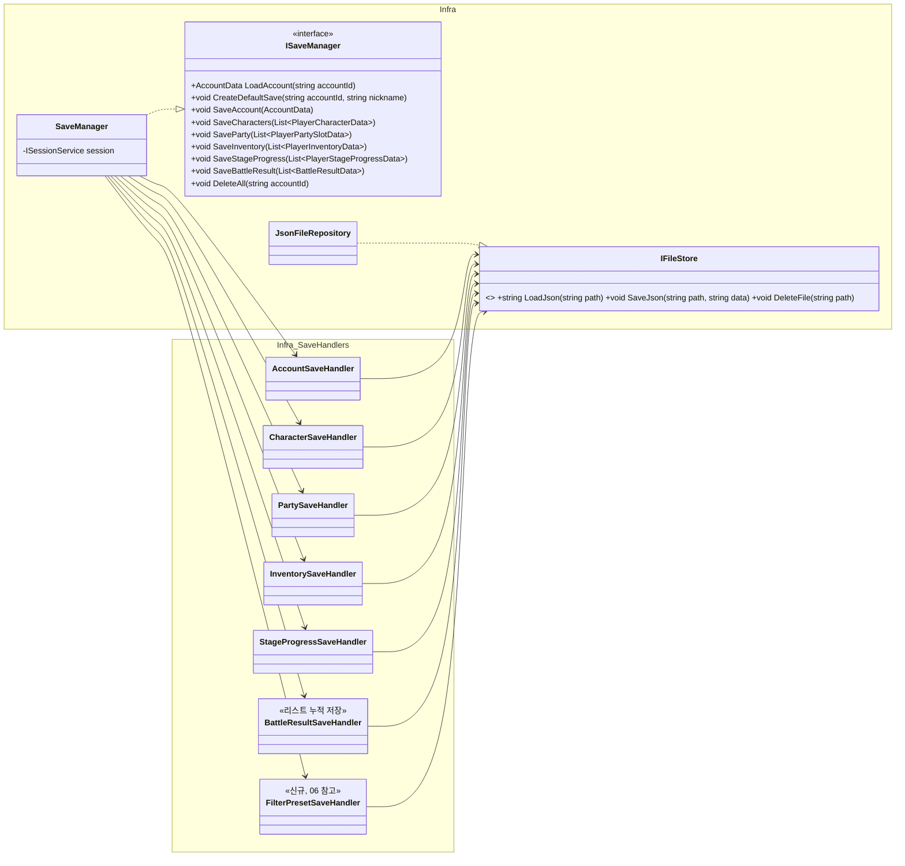
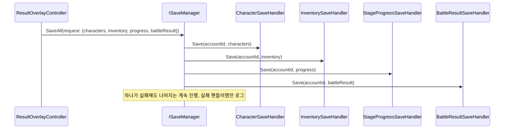

# 08. 저장 설계서 (SaveHandler 분해)

> 작성 기준일: 2026-08-03
> 문서 성격: Before 계승 + 미룬 항목 완성. 근거: `SaveHandler_설계서.md`, `구조개선_적용계획.md` §10, `서버전환_검토서.md` §5
> 공통 기반(`IFileStore`/`ISaveManager` 등)은 `09_공통기반_설계서.md` §5 참고.

## 0. 범위

세이브 파일 6종(계정/사도/파티/인벤토리/진행도/전투결과)의 저장·불러오기, 그리고 **각 서비스가 실제로 저장을 호출하는 배선**(Before가 "인프라만 만들고 호출부는 다음 작업"으로 미룬 부분).

## 1. 클래스 구조



**Approach A(채택, Before 결정 계승):** 핸들러는 타입 있는 `Save(accountId, data)`를 받는다. 호출부가 이미 들고 있는 객체를 그대로 넘긴다 — 별도 캐싱 계층을 두지 않는다(캐시-원본 불일치 위험 회피). `서버전환_검토서.md` §5가 권장하는 "요청 단위로 타입 있는 데이터를 넘기는" 방향과도 일치해, 나중에 서버 API로 바뀌어도 핸들러 시그니처가 크게 안 바뀐다.

**공용 `ISaveHandler` 인터페이스는 두지 않는다** — 핸들러마다 저장하는 리스트 타입이 전부 달라 다형적으로 순회할 일이 없다.

`BattleResultSaveHandler`는 최근 1건이 아니라 **리스트 누적 저장**이다 — `RewardService.CheckDuplicateGrant`(`07` 참고)가 과거 전투 기록 전체와 대조해야 하기 때문이다.

`FilterPresetSaveHandler`는 `06_사도성장_설계서.md` §6이 요구하는 신규 핸들러다 — 6종에 이번에 추가된다.

## 2. 완성 항목 — 저장 호출 배선

Before는 인프라(핸들러 6개 + `SaveManager`)만 만들고, **"언제 저장을 부를지"는 호출부(컨트롤러/서비스)의 몫**이라며 배선을 전부 미뤘다. 이번엔 각 컨텐츠 문서가 실제 화면·서비스를 설계했으므로, 저장 호출 지점을 확정한다.

| 저장 대상 | 호출 지점 | 근거 문서 |
|---|---|---|
| `SaveAccount` | `AuthController.SignUp` 이후 `CreateDefaultSave` (신규 계정) | `01` |
| `SaveCharacters` | `CharacterGrowthService.LevelUp/Promote/SkillLevelUp` 성공 시, `GachaController.Pull` 결과 지급 후 | `05`, `06` |
| `SaveParty` | `CommandHistory.ExecuteAndRecord`(`AssignSlotCommand`/`RemoveSlotCommand`) 성공 시 | `03` |
| `SaveInventory` | `InventoryService.AddItem`/`AddCurrency` 호출 직후 | `07` |
| `SaveStageProgress` | `StageProgressService.UpdateAfterVictory` 성공 시 | `03` |
| `SaveBattleResult` | `BattleResultBuilder.Build` 직후, `ResultOverlayController.Open` 이전 | `04`, `07` |
| `FilterPreset` 저장 | `RosterController`의 "필터 저장" 버튼 | `06` |

**부분 실패 처리(Before 결정 계승):** 롤백하지 않는다(best-effort). 파일마다 독립 JSON이라 원자적 롤백 인프라가 없고, 실패 시나리오(디스크/권한)가 흔치 않아 "된 것까지는 저장"이 실용적이다. 실패한 핸들러 이름만 로그로 남긴다.

**자동 저장 시점(Before 결정 계승):** 없음. 위 표의 호출 지점처럼 "무엇이 바뀌었을 때"만 명시적으로 저장한다.

## 3. 완성 항목 — `SaveManager.SaveAll` / `DeleteAll`

Before는 배선이 없어 "무엇을 한꺼번에 저장할지" 정할 수 없다는 이유로 `SaveAll()`을 만들지 않았다. 이번엔 §2 표로 호출 지점이 확정됐으므로, **전투 종료처럼 여러 항목이 동시에 바뀌는 지점**에 한해 오케스트레이션을 추가한다.

```
ISaveManager.SaveAll(SaveAllRequest request)
└ request에 담긴 것만 순서 없이(파일이 독립이라 순서 무관) 각 핸들러 호출
   예: 전투 종료 시 SaveCharacters + SaveInventory + SaveStageProgress + SaveBattleResult 4개를
       개별 호출 4번 대신 SaveAll(request) 한 번으로

ISaveManager.DeleteAll(string accountId)   ← 01의 계정 초기화가 요구
└ 6개 핸들러(FilterPreset 포함 7개) 전부에 대해 IFileStore.DeleteFile(path) 호출
```

`SaveAllRequest`는 선택적 필드(nullable) 여러 개를 담는 단순 데이터 객체다 — 호출부가 바뀐 것만 채워 넘긴다. 새 추상화(제네릭 배치 처리 등)를 만들지 않는다.

## 4. 시퀀스 다이어그램 — 전투 종료 시 일괄 저장



## 5. 완성 요약

| 항목 | Before 상태 | 이번 완성 |
|---|---|---|
| 6개 SaveHandler + `SaveManager` 개별 메서드 | 완료 | 계승 + `FilterPresetSaveHandler` 추가 |
| 각 서비스의 저장 호출 배선 | 미배선 | **완성** — §2 표로 확정 |
| `SaveManager.SaveAll` | 미착수(배선 없어 보류) | **완성** |
| `SaveManager.DeleteAll` | 없음 | **완성** — `01`의 계정 초기화 요구 충족 |
