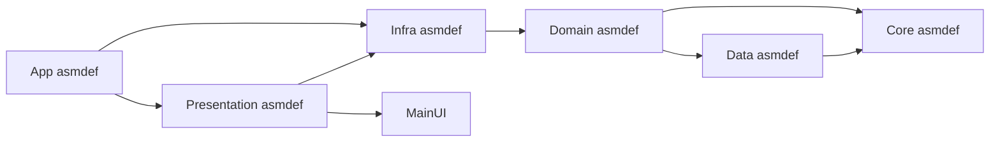
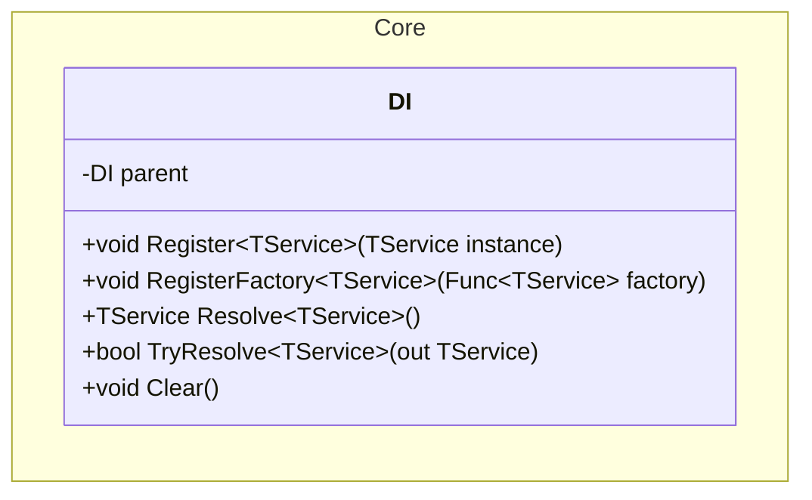
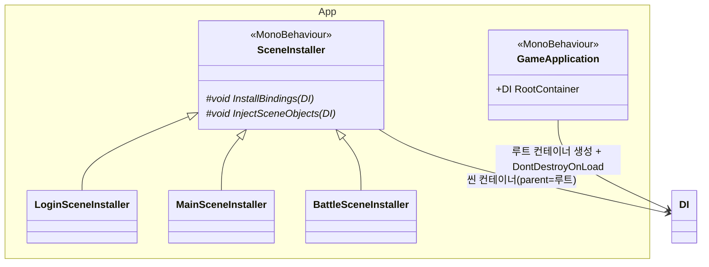
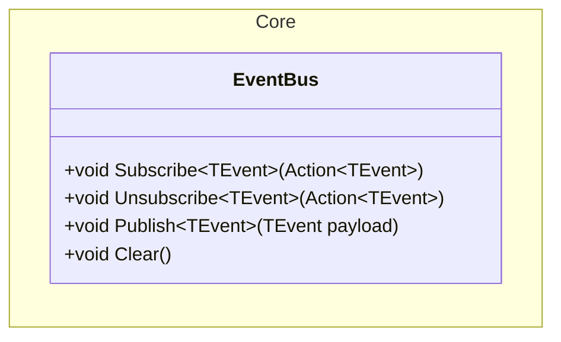
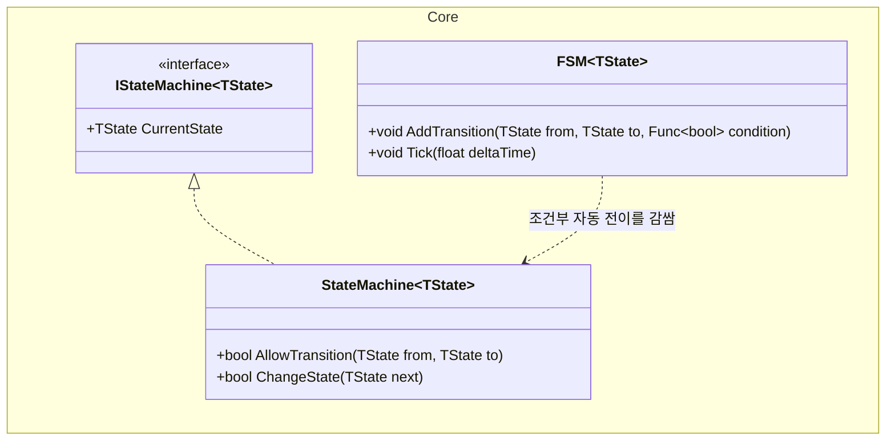
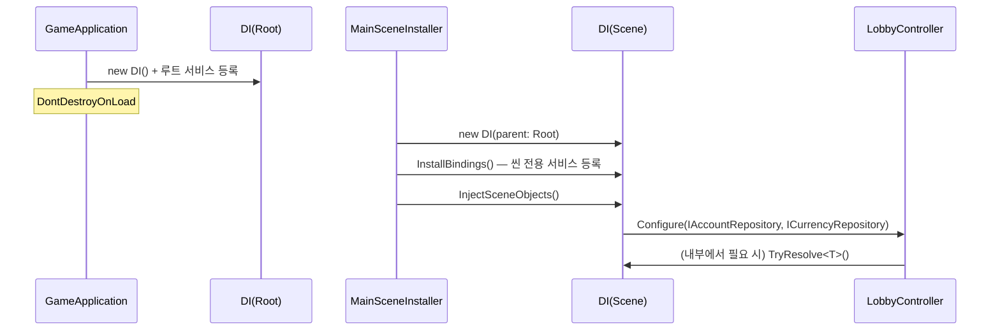
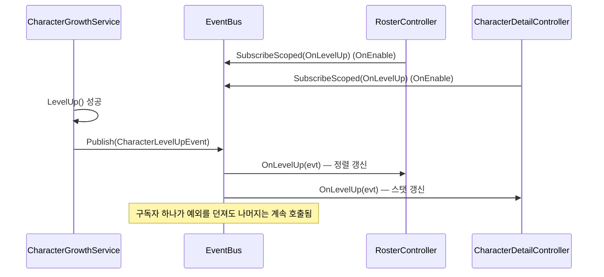

# 09. 공통 기반 설계서 (Core / DIP 경계 / 계층 강제)

> 작성 기준일: 2026-08-03
> 문서 성격: Before(`E:\Trickcal_Revive_Before`) 프로젝트가 그릴링 세션에서 검증(EditMode 테스트 237/237 통과)까지 마친 설계를 계승하고, "화면이 없어 미룬" 항목을 이번에 완성한 목표 설계다. 실제 코드 구현 여부는 다루지 않는다 — 새 프로젝트(`E:\Trickcal_Revive`)에 이 설계를 그대로 재구현하는 것을 전제로 한다.
> 근거 문서: `구조개선_적용계획.md` §1·§2·§9·§15, `구조개선_전후비교.md`, `클래스다이어그램_개선반영_설계도.md` §4, `클래스다이어그램_수정_260801.md` §2-1·2-2·2-10, `EventBus배선_설계서.md`
> 표기: `<<MonoBehaviour>>` = Unity 컴포넌트, `<<Serializable>>` = 순수 데이터(POCO), `<<interface>>`/`<<enumeration>>` = C# 타입

## 0. 이 문서의 위치

이 문서는 **특정 화면의 설계가 아니라, 9개 컨텐츠 문서(01~08)가 전부 공유하는 인프라**를 다룬다. `01_계정인증`이 `ISessionService`를 쓰고, `04_전투`가 `StateMachine<BattlePhase>`를 쓰고, `06_사도성장`이 `IGrowthRepository`를 쓸 때 — 그 밑바탕이 이 문서다. 다른 문서를 읽다가 `Core.*`나 `I*Repository`가 나오면 이 문서로 돌아온다.

## 1. 계층 구조 — asmdef 강제

Before에서 계층 규칙(Domain이 Infra를 참조하면 안 됨 등)을 사람이 코드리뷰로 지키다 순환 참조 3건이 났던 것을 계기로, **컴파일러가 강제**하는 방식으로 바꿨다. 새 프로젝트는 처음부터 이 구조로 시작한다(Before는 나중에 끼워 넣느라 순환을 먼저 끊어야 했지만, 새 프로젝트는 그 비용이 없다).



| 계층 | 참조 가능 대상 | 참조 불가 |
|---|---|---|
| `Core` | (없음) | 전부 |
| `Data` | `Core` | `Domain`, `Infra`, `Presentation`, `App` |
| `Domain` | `Core`, `Data` | **`Infra` (DIP 핵심)**, `Presentation`, `App` |
| `Infra` | `Core`, `Data`, `Domain` | `Presentation`, `App` |
| `Presentation` | `Core`, `Data`, `Domain`, `Infra`, `MainUI` | `App` |
| `App` | 전부 | — |

**이름 규칙과 배치 원칙(순환을 만들지 않기 위한 판단 기준):**
- `*Controller`, `*View` → `Presentation`
- `*Repository`, `SaveManager`, `JsonFileRepository`, `SessionService` → `Infra`
- 화면·저장을 모르는 순수 계산/규칙 → `Domain`
- 컨트롤러 여럿이 공유하는 씬 전환·세션 같은 것은 **파일 위치와 네임스페이스를 반드시 일치**시킨다 — Before에서 `SessionService`가 `Core/` 폴더에 있으면서 네임스페이스는 `App`이라 순환이 난 사례가 있었다.

**검증 수단 2개**(Before에서 실효성 확인됨, 그대로 계승):
- `tools/check-layers.sh` — Unity 에디터 없이 위반을 잡는 스크립트. 위반을 일부러 넣어 exit 1로 잡히는 것까지 확인된 도구.
- `Assets/Tests/EditMode/Architecture/LayerDependencyTests.cs` — 같은 규칙의 NUnit 버전. asmdef 컴파일 에러는 "타입을 못 찾음"만 알려주지만, 이건 어느 파일이 어느 계층을 위반했는지 이름으로 알려준다.

새 프로젝트는 **0단계로 asmdef 8개(App/Presentation/Infra/Infra.Editor/Domain/Data/Core/Tests)와 두 검증 수단을 먼저 구성**한 뒤 나머지 설계를 얹는다. Before는 순서를 못 지켜 순환부터 끊어야 했지만, 이번엔 순서 자체가 지켜진다.

## 2. Core.DI — 의존성 주입 컨테이너

### 2.1 API



- **부모 컨테이너 체인.** 씬마다 컨테이너를 새로 만들되, `parent`를 통해 루트 컨테이너(마스터데이터·세이브·세션·EventBus 등 씬을 넘어 사는 것)를 재등록 없이 이어받는다.
- **`RegisterFactory` 추가(완성 항목).** Before는 인스턴스 등록만 있었다. 전투 씬처럼 **판마다 새로 만들어야 하는 서비스**(예: `RandomTargetStrategy`의 시드, `CommandHistory`)는 인스턴스 등록으로는 표현이 안 된다 — 등록 시점에 만든 인스턴스 하나를 모든 소비자가 공유해버린다. `RegisterFactory<T>(Func<T> factory)`를 추가해 `Resolve<T>()`를 부를 때마다 새 인스턴스를 만들게 한다.
- **생성자 자동 주입은 도입하지 않는다.** (Before §18 결정 유지) 리플렉션 비용과, "누가 무엇에 의존하는지"가 코드에서 안 보이게 되는 문제 때문이다. 등록은 각 `SceneInstaller`가 손으로 한다 — 코드는 늘지만 의존관계가 파일 하나(`InstallBindings`)에 전부 드러난다.
- **컨트롤러에 컨테이너를 통째로 넘기지 않는다.** `Configure(IAccountRepository, ICurrencyRepository)`처럼 실제 쓰는 인터페이스만 파라미터로 받는다. 컨테이너를 넘기면 서비스 로케이터가 되어 DIP를 도입한 의미가 사라진다.

### 2.2 합성 지점(Composition Root)



```
GameApplication (DontDestroyOnLoad)
└ 루트 컨테이너 — MasterDataRepository, ISaveManager, ISessionService, EventBus
   ├ LoginSceneInstaller   → IAccountAuthRepository
   ├ MainSceneInstaller    → IAccountRepository, ICurrencyRepository, IPlayerCharacterRepository,
   │                         IPartyRepository, IStageProgressRepository, IInventoryRepository,
   │                         IGrowthRepository, PartyFormationValidator, CommandHistory(팩토리)
   └ BattleSceneInstaller  → 전투 서비스 8종(§4, `04_전투_설계서.md` 참고) + BattlePhase 전이 규칙
```

전투 서비스를 루트가 아니라 씬 컨테이너에 두는 이유는 **이전 판의 상태가 다음 판으로 새는 것을 구조로 막기 위해서다**(씬을 나가면 컨테이너와 함께 사라진다).

## 3. Core.EventBus — Observer

### 3.1 API (이미 확정 — Before가 검증 완료)



- **타입 기반**(`Subscribe<T>`/`Publish<T>`). 문자열 키는 `"CurrencyChanged"`와 `"CurrencyChange"`가 다른 이벤트가 되는 오타를 조용히 통과시킨다. 타입으로 바꾸면 이 실수가 컴파일 에러가 된다.
- **`Publish`는 구독자별로 예외를 격리한다**(`try/catch` + 로그). 구독자 A가 예외를 던져도 B는 정상 호출된다 — 안 그러면 A의 버그가 B의 "이벤트 안 옴" 버그로 둔갑한다.
- `Clear()` — 씬을 벗어날 때 남은 구독을 일괄 정리하는 안전망.

### 3.2 이벤트 7종 완성 (미룬 4개 포함)

Before는 발행 주체가 실제로 동작하는 3개(`CharacterLevelUp`/`BattleStarted`/`BattleEnded`)만 배선하고, 나머지 4개는 "발행할 서비스 자체가 스텁"이라는 이유로 미뤘다. 이번엔 그 4개의 발행 주체(`06_사도성장`, `07_인벤토리재화`가 다루는 서비스)도 설계 대상에 포함되므로 전부 완성한다.

| 이벤트 | 발행 | 주요 구독(목표) | 상태 |
|---|---|---|---|
| `CharacterLevelUpEvent` | `CharacterGrowthService.LevelUp()` 성공 시 | 로스터 정렬, 사도상세 | 계승(배선 완료) |
| `BattleStartedEvent` | `BattleFacade.Start()` | 화면, 사운드, 저장 | 계승(배선 완료) |
| `BattleEndedEvent` | `BattleFacade`가 `Result`로 전이할 때, `ClearReason` 기반 | 결과 오버레이 연출 | 계승(§8단계 버그 수정 반영 — `!IsPlayerWiped` 근사치 대신 `ClearReason == EnemyWiped` 사용) |
| `CurrencyChangedEvent` | `InventoryService.AddCurrency` | 로비, 사도상세, 상점, 배낭 | **완성** — `07_인벤토리재화_설계서.md` |
| `InventoryChangedEvent` | `InventoryService.AddItem` | 배낭, 승급 버튼 | **완성** — `07_인벤토리재화_설계서.md` |
| `RewardGrantedEvent` | `RewardService.GrantRewards` | 결과 오버레이 연출 | **완성** — `07_인벤토리재화_설계서.md` |
| `StageClearedEvent` | `StageProgressService.UpdateAfterVictory` | 스테이지 선택 화면 갱신 | **완성** — `03_파티편성_설계서.md` |

**발행 중 고빈도 이벤트(피해 발생 등)는 EventBus에 태우지 않는다.** 10Hz tick × 유닛 60명이면 초당 수백 건이 발생해 구독자 순회 비용이 전투 성능에 영향을 준다. 전투 내부 통신은 EventBus가 아니라 `04_전투_설계서.md`의 `BattleContextView`/컴포넌트 직접 호출로 처리한다.

### 3.3 구독 해제 — `AutoUnsubscribe` 헬퍼 (완성)

Before는 "구독-해제는 각자 `OnEnable`/`OnDisable` 짝을 맞추는 관례"로 미루고 헬퍼를 만들지 않았다(검증할 소비 화면이 없었기 때문). 이번엔 소비 화면이 다수 설계되므로 헬퍼를 완성한다.

```
EventSubscription : IDisposable
├ 생성 시점에 EventBus.Subscribe<T> 등록
└ Dispose()에서 EventBus.Unsubscribe<T> 호출

EventBus.SubscribeScoped<TEvent>(Action<TEvent> handler) : EventSubscription
```

`MonoBehaviour`는 `OnEnable`에서 `_subscription = eventBus.SubscribeScoped<T>(OnEvent)`로 받고, `OnDisable`에서 `_subscription.Dispose()` 한 줄로 끝낸다. 짝을 빠뜨리면 파괴된 객체가 계속 호출돼 예외가 나는 문제를 컴파일 타임에 강제하진 못하지만(여전히 `Dispose` 호출을 잊을 순 있다), 적어도 해제 코드가 `Unsubscribe(handler)`처럼 핸들러 레퍼런스를 직접 다루지 않아도 되게 만든다.

## 4. Core.StateMachine / FSM



- `TState`는 `where TState : struct`(Before가 `IEquatable<TState>` 제약으로 시작했다가, enum이 이 제약을 만족 못 해 첫 실사용에서 컴파일 에러가 났던 이력이 있다 — `struct` 제약 + `EqualityComparer<TState>.Default` 비교로 확정).
- `StateMachine<T>`는 수동 전이(`ChangeState` 호출)만 한다. `FSM<T>`가 그 위에서 조건을 매 tick 평가해 자동으로 `ChangeState`를 불러준다.
- **용도가 분리된다.** 전투 단계(`BattlePhase`)처럼 상태별 로직이 무거운 곳은 `04_전투_설계서.md`의 State 패턴(`IBattleState` + `BattleFacade`가 `StateMachine<BattlePhase>`를 직접 조작)을 쓰고, 화면 전환처럼 조건만 있으면 되는 곳은 `FSM<T>`를 쓴다. **중복 구현(Before의 `Domain.Battle.BattleStateMachine`)은 만들지 않는다** — 이미 Before에서 삭제가 확정된 결정을 유지한다.

## 5. Repository DIP — Domain 인터페이스 경계

### 5.1 원칙

Domain 계층의 모든 화살표가 **인터페이스**를 향하게 한다. `IRepository<T>` 같은 공통 제네릭 틀은 쓰지 않는다 — 마스터 데이터(읽기 전용)에 `Save`/`Delete`를 물려주면 `NotSupportedException`을 던지는 빈 메서드가 생긴다(ISP 위반). **파일 단위가 아니라 도메인 단위**로 인터페이스를 쪼갠다 — 구현체 1개가 여러 인터페이스를 나눠 구현한다.

### 5.2 인터페이스 전체 목록 (완성 — 10개 확정)

```mermaid
classDiagram
    direction TB
    namespace Domain {
        class ICharacterRepository { <<interface>> +UnitMasterData GetCharacter(CharacterId) +List~UnitMasterData~ GetPlayableCharacters() }
        class IStageRepository { <<interface>> +StageMasterData GetStage(StageId) }
        class IGrowthRepository { <<interface>> +GrowthTableData GetGrowthStep(GrowthType, int step) }
        class IAccountRepository { <<interface>> +AccountData GetAccount() }
        class IPlayerCharacterRepository { <<interface>> +List~PlayerCharacterData~ GetOwnedCharacters() +void GrantCharacter(CharacterId, int star) }
        class IPartyRepository { <<interface>> +List~PlayerPartySlotData~ GetPartySlots(string partyId) }
        class ICurrencyRepository { <<interface>> +List~PlayerCurrencyData~ GetCurrencies() }
        class ICurrencyWallet { <<interface>> +long GetAmount(CurrencyType) +bool TryConsume(CurrencyType, long) }
        class IInventoryRepository { <<interface>> +List~PlayerInventoryData~ GetOwnedItems() +bool TryConsume(ItemId, long) }
        class IStageProgressRepository { <<interface>> +PlayerStageProgressData GetStageProgress(StageId) }
        class IAccountAuthRepository { <<interface>> +bool VerifyPassword(string, string) +AccountData CreateAccount(string, string, string) }
    }
    namespace Infra {
        class ISessionService { <<interface>> +void SaveSession(string accountId) +string GetSession() }
        class IFileStore { <<interface>> +string LoadJson(string path) +void SaveJson(string path, string data) }
        class ISaveManager { <<interface>> +void SaveCharacters(...) +void SaveParty(...) }
        class MasterDataRepository
        class PlayerDataRepository
        class AccountAuthRepository
        class SessionService
        class JsonFileRepository
        class SaveManager
    }
    MasterDataRepository ..|> ICharacterRepository
    MasterDataRepository ..|> IStageRepository
    MasterDataRepository ..|> IGrowthRepository
    PlayerDataRepository ..|> IAccountRepository
    PlayerDataRepository ..|> IPlayerCharacterRepository
    PlayerDataRepository ..|> IPartyRepository
    PlayerDataRepository ..|> ICurrencyRepository
    PlayerDataRepository ..|> ICurrencyWallet
    PlayerDataRepository ..|> IInventoryRepository
    PlayerDataRepository ..|> IStageProgressRepository
    AccountAuthRepository ..|> IAccountAuthRepository
    SessionService ..|> ISessionService
    JsonFileRepository ..|> IFileStore
    SaveManager ..|> ISaveManager
```



| 인터페이스 | 구현체 | 상태 |
|---|---|---|
| `ICharacterRepository`, `IStageRepository`, `IGrowthRepository` | `MasterDataRepository` | 계승 |
| `IAccountRepository`, `IPlayerCharacterRepository`, `IPartyRepository`, `ICurrencyRepository`, `ICurrencyWallet`, `IInventoryRepository`, `IStageProgressRepository` | `PlayerDataRepository` | 계승 |
| `IAccountAuthRepository` | `AccountAuthRepository` | 계승 |
| `ISessionService` | `SessionService` | 계승 |
| `IFileStore` | `JsonFileRepository` | 계승 |
| `ISaveManager` | `SaveManager` | 계승 (구조는 `08_저장_설계서.md`에서 상세) |

`IGrowthRepository`/`IInventoryRepository`는 Before에서 한때 "`GrowthTableData`/`PlayerInventoryData` 클래스가 없어 컴파일이 안 된다"는 이유로 미뤘던 항목인데, 이후 Data 계층 정리(3단계)에서 두 클래스가 실제로 신설되며 함께 해소됐다. 이번 설계에서는 **처음부터 막힘없이 포함**한다.

**캐릭터 합성 인터페이스(`IBase`/`IApostle`/`IPersonality`/`IRole`/`IPlacement`)는 이 문서의 범위가 아니다** — 사도 도메인 모델 자체의 설계 문제라 `06_사도성장_설계서.md`에서 다룬다.

### 5.3 컨트롤러가 좁아지는 예

```csharp
// 이전 — PlayerDataRepository 통째로
public void Configure(PlayerDataRepository dataRepository)

// 이후 — 실제로 쓰는 것만
public void Configure(IAccountRepository accounts, ICurrencyRepository currencies)
```

`LobbyController`는 프로필과 재화만 그리므로 이 둘만 받는다. 파티·스테이지진행도·사도지급까지 볼 수 있던 이전 방식과 달리, **컨트롤러 시그니처만 봐도 그 화면이 무엇을 할 수 있는지 알 수 있다.**

## 6. Core.Pool / Core.Utility

| 클래스 | API | 용도 |
|---|---|---|
| `Pool` | `Get(prefab)` / `Release(instance)` / `Prewarm(prefab, count)` | 전투 이펙트, 데미지 텍스트, `04_전투_설계서.md`의 소환수(쥬비 꿀벌) 재사용 |
| `Utility` | `Format(value)` / `Clamp(value, min, max)` | 화면 표시 포맷팅 공용 헬퍼 |

두 클래스는 Before에서 이미 구현이 끝나 있었다(구조개선 문서가 한때 "Core 전체 미구현"이라 잘못 적었던 것을 이후 바로잡음). 이번 설계에서 API 변경은 없다.

## 7. 시퀀스 다이어그램

### 7-1. 씬 진입 시 DI 배선



### 7-2. 이벤트 발행-구독 (레벨업 예시)



## 8. 이번에 완성한 것 — 요약

| 항목 | Before 상태 | 이번 완성 내용 |
|---|---|---|
| `DI.RegisterFactory<T>` | 없음(인스턴스 등록만) | 팩토리 등록 추가 — 판마다 새로 만들어야 하는 서비스 지원 |
| `CurrencyChanged`/`InventoryChanged`/`RewardGranted`/`StageCleared` | 발행처가 스텁이라 미룸 | 발행처 설계 포함(`07_인벤토리재화`, `03_파티편성`) + 배선 |
| `AutoUnsubscribe`(`SubscribeScoped`) | 소비 화면 없어 미룸 | `EventSubscription : IDisposable` 헬퍼로 완성 |
| `IGrowthRepository`/`IInventoryRepository` | 한때 클래스 부재로 막힘 | 처음부터 포함(막을 이유 없음) |

## 9. 결정 대기였던 항목 — 확정

| 항목 | Before 결정 | 이번 문서에서 유지 여부 |
|---|---|---|
| MonoBehaviour 주입 방식 | (b) SceneInstaller | 유지 |
| DI 컨테이너 수명 | 씬마다 새로, 부모 체인으로 루트 공유 | 유지 |
| asmdef 도입 여부 | 도입 | 유지, 0단계로 앞당김 |
| 모르는 마스터 코드 처리 | `Unknown` enum + 검증 리포트 | 유지(`MasterDataValidationReport`, `05_사도성장_설계서.md`\* 참고) |

\* 성장/코드 검증은 `06_사도성장_설계서.md`에서 상세를 다룬다.
