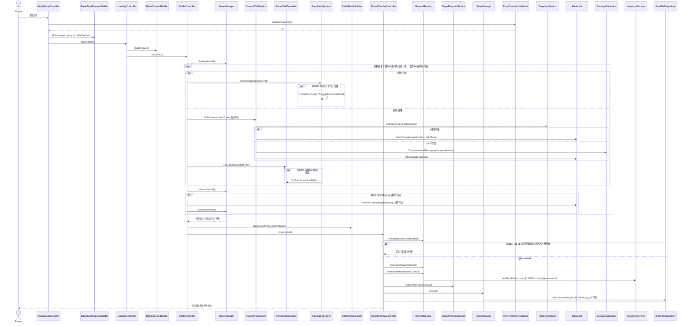
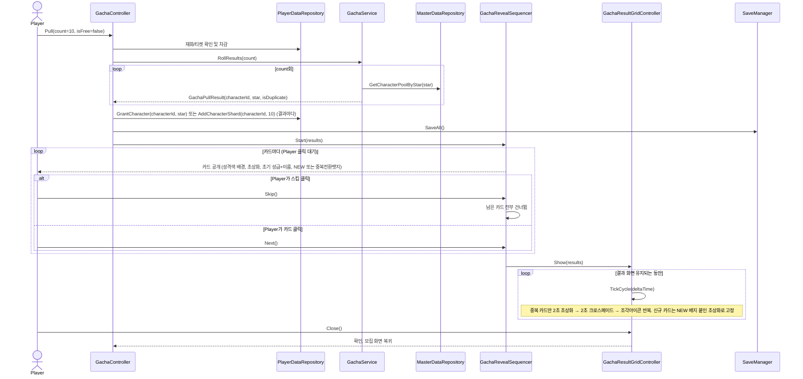

# 트릭컬 포트폴리오 아키텍처 설계서 (클래스/시퀀스 다이어그램)

> 작성 기준일: 2026-07-19
> 문서 상태: 확정안 (피드백 반영, 그릴링 세션 결과)
> 원본 클래스다이어그램: `E:\Projects\Unity Projects\Trickcal_Revive_Clone\기획 자료\클래스다이어그램 260702.txt`
> 원본 피드백: `E:\Projects\Unity Projects\Trickcal_Revive_Clone\기획 자료\기획서 및 프로토타입 피드백 260702.txt`
> 관련 문서: `docs/전체_기획서.md`, `docs/DB_설계서.md`, `docs/레벨디자인_설계서.md`

이 문서는 260702 피드백("일단 돌아가게만 만든 코드 말고, 책임이 분리된 클래스 구조로 다시 그려달라")을 반영해 클래스다이어그램을 다시 그리고, 260702 다이어그램에는 없었던 계정 로그인·AUTO 확장·액티브 스킬 쿨타임·사거리 이동 전투·모집 연출 등 이번 세션에 추가된 기능을 새 클래스로 채워 넣은 것이다. 원본 다이어그램이 세운 "저장/데이터/화면/전투계산 분리" 원칙은 그대로 유지하고, 그 위에 새 기능들을 같은 원칙으로 얹었다.

## 1. DB 설계 재검토 결과

`docs/DB_설계서.md`를 피드백 7개 항목 기준으로 다시 확인한 결과, **스키마 자체는 추가로 손댈 부분이 실질적으로 없다.**

| 피드백 항목 | DB 설계서 반영 상태 |
|---|---|
| 2. 고정값과 진행상황이 섞임 | 이미 만족. §1에서 MasterData/SaveData를 분류하고, `character_master`(고정) vs `player_character_save`(성장), `stage_master`(고정) vs `player_progress_save`(진행)로 분리돼 있다 |
| 5. 스킬이 이름/역할 비교로 처리됨 | 이미 만족. `combat_master.skills`/`effects`가 데이터로 정의돼 있어 캐릭터 이름을 직접 비교할 필요가 없다 |
| 7. 보상 중복지급 안전장치 없음 | 이미 만족. `pending_transaction_id`+§7 트랜잭션 상태(Prepared→Pending→Committed→Displayed)로 이미 설계돼 있었고, 이번에 `battle_result.battle_log_id`가 실제 중복 판정 키임을 명시하는 문장을 §6.1에 보강했다(유일하게 손댄 부분) |
| 1·3·4·6. 저장 계층 분리, 화면전환/로직 분리, 유닛 캡슐화, 유니티 이전 특이사항 | DB 스키마가 아니라 **코드 클래스 구조** 문제라 DB 설계서 범위 밖. 이 문서 §2의 클래스다이어그램에서 다룬다 |

## 2. 클래스 다이어그램

원본 다이어그램의 계층 분리 원칙(`SaveManager`↔`JsonFileRepository`, `Controller`↔`Service`↔`Repository`, `BattleUnit`이 자기 상태를 스스로 관리)을 유지하면서 다음을 새로 추가했다.

- **인증**: `LoginController`(게스트 로그인/이어하기)를 `AuthController`(아이디+비밀번호 로그인/가입)로 교체, `AccountAuthRepository`·`SessionService` 신설
- **설정**: `SettingsController` 신설 (로그아웃/계정초기화, 원본에는 없던 화면)
- **전투**: `BattleUnit`에 자가관리 메서드 추가(`TakeDamage`, `MoveToward`, `IsInRange`, `ReturnToFormation`), 사거리·이동 계산을 맡는 `CombatTickService` 신설, 액티브 스킬 쿨타임을 맡는 `ActiveSkillController` 신설, `AutoBattleSystem`에 준비단계 자동구매/장착 메서드 추가
- **모집**: 원본에는 모집 관련 클래스가 하나도 없었다. `GachaController`/`GachaService`/`GachaRevealSequencer`/`GachaResultGridController`를 전부 신설

```mermaid
classDiagram
    direction LR

    class GameApplication {
        +Initialize()
        +StartGame()
        +Shutdown()
    }

    class SceneFlowController {
        +Go(sceneId)
        +ShowLoading(type, targetScene)
        +Back()
    }

    class SessionService {
        +SaveSession(accountId)
        +GetSession()
        +ClearSession()
    }

    class SaveManager {
        +LoadAccount(accountId)
        +SaveAll()
        +SaveParty()
        +SaveStageProgress()
        +SaveBattleResult()
        +CreateDefaultSave(accountId, nickname)
    }

    class JsonFileRepository {
        +LoadJson(path)
        +SaveJson(path, data)
        +Exists(path)
        +CreateBackup(path)
    }

    class MasterDataRepository {
        +LoadCharacterMaster()
        +LoadStageMaster()
        +LoadGachaBanner()
        +GetCharacter(characterId)
        +GetStage(stageId)
        +GetStarterCharacters()
    }

    class PlayerDataRepository {
        +GetAccount()
        +GetCurrencies()
        +GetOwnedCharacters()
        +GetPartySlots(partyId)
        +GetStageProgress(stageId)
        +GetInventory()
        +GrantCharacter(characterId, star)
        +AddCharacterShard(characterId, count)
    }

    class AccountAuthRepository {
        +IsLoginIdTaken(loginId)
        +CreateAccount(loginId, password, nickname)
        +VerifyPassword(loginId, password)
        +DeleteAccount(accountId)
    }

    class AuthController {
        +Login(loginId, password)
        +SignUp(loginId, password, nickname)
    }

    class SettingsController {
        +Logout()
        +ResetAccount()
    }

    class LobbyController {
        +RenderProfile()
        +RenderCurrencies()
        +OpenAdventure()
        +OpenSettings()
    }

    class AdventureController {
        +SelectInvasion()
    }

    class StageSelectController {
        +RenderStageNodes()
        +SelectStage(stageId)
        +CheckUnlocked(stageId)
        +OpenStageInfo(stageId)
    }

    class StageInfoPopupController {
        +BuildPopup(stageId)
        +Show()
        +Close()
        +EnterPartySetup()
    }

    class PartySetupController {
        +RenderFormation()
        +RenderRoster()
        +SelectCharacter(playerCharacterId)
        +AssignToSlot(x, y)
        +RemoveSlot(playerCharacterId)
        +AutoBuildParty()
        +ResetParty()
        +StartBattle()
    }

    class PartyFormationValidator {
        +Validate(partySlots)
        +CheckEmpty()
        +CheckDuplicateCharacter()
        +CheckInvalidPosition()
    }

    class BattleStartRequestBuilder {
        +Build(stageId, partyId, battleOptions)
    }

    class LoadingController {
        +Show(type, message)
        +Complete()
        +Fail(error)
    }

    class BattleContextBuilder {
        +Build(request)
        +LoadStage()
        +LoadWaves()
        +LoadRewards()
        +LoadPartyMembers()
    }

    class BattleController {
        +Init(context)
        +Start()
        +Tick(deltaTime)
        +Pause()
        +Resume()
        +ChangeSpeed(speed)
        +Finish(resultType, reason)
    }

    class BattleStateMachine {
        +CurrentState
        +ChangeState(state)
        +CanTransition(nextState)
    }

    class BattleRuntimeState {
        +battleId
        +elapsedTime
        +currentPhase
        +currentWaveIndex
        +battleSpeed
        +isAutoBattle
        +units
        +cardSlots
        +resultProcessed
    }

    class BattleUnitFactory {
        +CreatePlayerUnit(partySlot)
        +CreateEnemyUnit(enemyWaveData)
    }

    class BattleUnit {
        +runtimeId
        +team
        +masterId
        +hp
        +maxHp
        +sp
        +attack
        +defense
        +range
        +formationPosition
        +currentPosition
        +activeSkillCooldownRemaining
        +alive
        +TakeDamage(amount)
        +Heal(amount)
        +IsDead()
        +IsInRange(target)
        +MoveToward(targetPosition, deltaTime)
        +ReturnToFormation(deltaTime)
        +IsActiveSkillReady()
    }

    class WaveManager {
        +SpawnWave(index)
        +IsWaveCleared()
        +HasNextWave()
        +MoveNextWave()
    }

    class CombatTickService {
        +TickUnit(unit, deltaTime)
        +ResolveMoveOrAttack(unit, target, deltaTime)
    }

    class ActiveSkillController {
        +OnIconClicked(unit)
        +TickCooldowns(deltaTime)
        +IsUnlocked(unit)
    }

    class AutoBattleSystem {
        +TickPreparation(deltaTime)
        +TryAutoBuyCard()
        +TryAutoEquipCard(card)
        +TryAutoCastActiveSkill()
    }

    class TargetingService {
        +SelectNormalTarget(attacker)
        +SelectLowHpAlly(caster)
        +SelectSkillTargets(caster, skill)
    }

    class DamageCalculator {
        +CalculateNormalDamage(attacker, defender)
        +CalculateSkillDamage(attacker, defender, skill)
        +CalculateHealAmount(caster, skill)
    }

    class SkillSystem {
        +GenerateCards()
        +CanUseCard(card)
        +UseCard(cardIndex)
        +ApplySkill(caster, skill)
        +RerollCards()
    }

    class BattleResultBuilder {
        +Build(resultType, runtimeState)
        +CalculateStarCount()
        +BuildSnapshot()
    }

    class ResultOverlayController {
        +Open(result)
        +ShowVictory(result)
        +ShowDefeat(result)
        +Retry()
        +GoNextStage()
        +GoPartySetup()
        +GoStageSelect()
        +GoLobby()
    }

    class RewardService {
        +CalculateRewards(result)
        +GrantRewards(rewards, result)
        +CheckDuplicateGrant(battleId)
    }

    class StageProgressService {
        +UpdateAfterVictory(result)
        +UnlockNextStage(stageId)
        +MarkFirstRewardClaimed(stageId)
        +MarkThreeStarRewardClaimed(stageId)
    }

    class InventoryService {
        +AddItem(itemId, count)
        +AddCurrency(currencyType, amount)
    }

    class GachaController {
        +Pull(count, isFree)
    }

    class GachaService {
        +RollResults(count)
        +GrantCharacter(star)
    }

    class GachaRevealSequencer {
        +Start(results)
        +Next()
        +Skip()
        +Current()
    }

    class GachaResultGridController {
        +Show(results)
        +TickCycle(deltaTime)
        +Close()
    }

    class AccountData {
        +accountId
        +loginId
        +password
        +nickname
        +playerLevel
        +exp
        +saveVersion
    }

    class PlayerCurrencyData {
        +currencyId
        +accountId
        +currencyType
        +amount
    }

    class CharacterMasterData {
        +characterId
        +name
        +role
        +personality
        +isStarter
        +baseStatsJson
        +growthJson
        +skillsJson
        +resourceKey
        +enabled
    }

    class PlayerCharacterData {
        +playerCharacterId
        +accountId
        +characterId
        +level
        +star
        +exp
        +combatPower
        +statBonusJson
    }

    class PlayerPartySlotData {
        +partySlotId
        +accountId
        +partyId
        +slotIndex
        +playerCharacterId
        +side
        +posX
        +posY
    }

    class StageMasterData {
        +stageId
        +chapterId
        +stageNo
        +name
        +recommendedPower
        +staminaCost
        +starConditions1
        +starConditions2
        +nextStageId
        +wavesJson
        +rewardsJson
        +unlockConditionJson
    }

    class PlayerStageProgressData {
        +progressId
        +accountId
        +stageId
        +isUnlocked
        +isCleared
        +star1
        +star2
        +bestTimeSec
        +clearCount
        +firstRewardClaimed
        +threeStarRewardClaimed
    }

    class BattleStartRequest {
        +requestId
        +stageId
        +partyId
        +partyMembers
        +battleOptions
        +createdAt
    }

    class BattleContext {
        +contextId
        +request
        +stage
        +waves
        +rewards
        +party
        +createdAt
    }

    class BattleResultData {
        +battleId
        +accountId
        +stageId
        +resultType
        +clearReason
        +clearTimeSec
        +starCount
        +waveClearCount
        +rewardJson
        +snapshotJson
        +createdAt
    }

    class GachaPullResult {
        +characterId
        +star
        +isDuplicate
    }

    GameApplication --> SceneFlowController
    GameApplication --> SaveManager
    GameApplication --> MasterDataRepository
    GameApplication --> SessionService

    SaveManager --> JsonFileRepository
    SaveManager --> PlayerDataRepository
    MasterDataRepository --> JsonFileRepository
    PlayerDataRepository --> JsonFileRepository

    AuthController --> AccountAuthRepository
    AuthController --> SessionService
    AuthController --> SaveManager
    AccountAuthRepository --> JsonFileRepository

    SettingsController --> SessionService
    SettingsController --> SaveManager

    LobbyController --> PlayerDataRepository
    LobbyController --> SettingsController
    AdventureController --> SceneFlowController

    StageSelectController --> MasterDataRepository
    StageSelectController --> PlayerDataRepository
    StageSelectController --> StageInfoPopupController

    StageInfoPopupController --> MasterDataRepository
    StageInfoPopupController --> PartySetupController

    PartySetupController --> PlayerDataRepository
    PartySetupController --> PartyFormationValidator
    PartySetupController --> BattleStartRequestBuilder
    PartySetupController --> LoadingController

    BattleStartRequestBuilder --> BattleStartRequest
    LoadingController --> BattleContextBuilder
    BattleContextBuilder --> BattleContext
    BattleContextBuilder --> MasterDataRepository
    BattleContextBuilder --> PlayerDataRepository

    BattleController --> BattleRuntimeState
    BattleController --> BattleStateMachine
    BattleController --> BattleUnitFactory
    BattleController --> WaveManager
    BattleController --> CombatTickService
    BattleController --> ActiveSkillController
    BattleController --> AutoBattleSystem
    BattleController --> SkillSystem
    BattleController --> BattleResultBuilder

    BattleUnitFactory --> BattleUnit
    WaveManager --> BattleUnit
    CombatTickService --> TargetingService
    CombatTickService --> DamageCalculator
    CombatTickService --> BattleUnit
    ActiveSkillController --> BattleUnit
    AutoBattleSystem --> SkillSystem
    AutoBattleSystem --> ActiveSkillController
    SkillSystem --> TargetingService
    SkillSystem --> DamageCalculator
    BattleResultBuilder --> BattleResultData

    BattleController --> ResultOverlayController
    ResultOverlayController --> RewardService
    ResultOverlayController --> StageProgressService
    ResultOverlayController --> SaveManager

    RewardService --> InventoryService
    RewardService --> PlayerDataRepository
    StageProgressService --> PlayerDataRepository

    GachaController --> GachaService
    GachaController --> PlayerDataRepository
    GachaController --> GachaRevealSequencer
    GachaController --> SaveManager
    GachaService --> MasterDataRepository
    GachaService --> GachaPullResult
    GachaRevealSequencer --> GachaResultGridController

    AccountData "1" --> "many" PlayerCurrencyData
    AccountData "1" --> "many" PlayerCharacterData
    AccountData "1" --> "many" PlayerPartySlotData
    AccountData "1" --> "many" PlayerStageProgressData
    AccountData "1" --> "many" BattleResultData

    CharacterMasterData "1" --> "many" PlayerCharacterData
    PlayerCharacterData "1" --> "many" PlayerPartySlotData
    StageMasterData "1" --> "many" PlayerStageProgressData
    StageMasterData "1" --> "many" BattleResultData
```

### 2.1 원본 다이어그램 대비 변경 목록

| 구분 | 클래스/변경 내용 | 이유 |
|---|---|---|
| 교체 | `LoginController` → `AuthController` | 게스트 로그인/이어하기 → 아이디+비밀번호 로그인/가입으로 화면 자체가 바뀜 |
| 신규 | `AccountAuthRepository` | 아이디 중복 확인, 비밀번호 검증은 계정 데이터 접근이라 별도 리포지토리로 분리 (피드백 1번 원칙 적용) |
| 신규 | `SessionService` | 새로고침 시 자동 로그인 유지(세션)는 저장 데이터와는 다른 책임이라 분리 |
| 신규 | `SettingsController` | 원본에는 없던 화면(로그아웃/계정초기화를 로비 설정으로 이동) |
| 확장 | `BattleUnit`에 `TakeDamage`/`MoveToward`/`IsInRange`/`ReturnToFormation` 추가 | 피드백 4번(유닛이 데이터 덩어리) 대응 + 사거리·이동 전투 기능 반영 |
| 신규 | `CombatTickService` | "타겟이 사거리 밖이면 이동, 안이면 공격" 판단은 유닛 개별 책임도, 컨트롤러 책임도 아닌 별도 전투 루프 서비스로 분리 |
| 신규 | `ActiveSkillController` | 액티브 스킬 쿨타임(클릭→10초, 시계방향 마스크)은 전투 계산과는 다른 화면 상태라 분리 |
| 확장 | `AutoBattleSystem`에 `TryAutoBuyCard`/`TryAutoEquipCard`/`TickPreparation` 추가 | AUTO 범위가 SP스킬 자동발동에서 준비단계 자동구매/장착까지 넓어짐 |
| 신규 | `GachaController`/`GachaService`/`GachaRevealSequencer`/`GachaResultGridController` | 원본에 모집 관련 클래스가 전혀 없었음. 뽑기 계산(`GachaService`)과 카드 공개 연출(`GachaRevealSequencer`)과 결과 그리드 연출(`GachaResultGridController`)을 각각 분리해, 나중에 연출만 바꾸고 싶을 때 계산 로직을 건드리지 않도록 함(피드백 3번 원칙 적용) |
| 확장 | `CharacterMasterData.isStarter`, `AccountData.loginId`/`password` | 이번 세션 데이터 변경사항을 데이터 클래스에도 반영 |
| 확장 | `BattleRuntimeState.battleSpeed`/`isAutoBattle` | 준비단계는 배속 무관 고정 1배, 전투단계만 배속 적용되는 규칙을 구분해서 표현 |

## 3. 시퀀스 다이어그램 — 전투 (시작 ~ 결과, 보상 중복지급 방지)

## 4. 시퀀스 다이어그램 — 모집(가챠)

## 5. 피드백 대응 커버리지

| 피드백 항목 | 이 문서에서 대응하는 부분 |
|---|---|
| 1. 저장방식이 너무 단순함 | `SaveManager`(무엇을 저장할지) ↔ `JsonFileRepository`(어떻게 파일에 쓸지) 분리 유지, 계정 인증도 `AccountAuthRepository`로 별도 분리 |
| 2. 고정값과 진행상황이 섞임 | DB 설계서 §1에서 이미 만족(§1 참고). 클래스단에서도 `MasterDataRepository` ↔ `PlayerDataRepository`로 분리 유지 |
| 3. 화면전환과 로직이 한 함수에 뭉침 | `ResultOverlayController`는 화면만, 보상은 `RewardService`, 저장은 `SaveManager`, 진행도는 `StageProgressService`로 분리(원본 구조 유지). 모집도 계산(`GachaService`)과 연출(`GachaRevealSequencer`/`GachaResultGridController`)을 분리 |
| 4. 유닛이 데이터 덩어리 | `BattleUnit`에 `TakeDamage`/`MoveToward`/`IsInRange`/`ReturnToFormation` 등 자기관리 메서드 추가 |
| 5. 스킬이 이름/역할 비교로 처리됨 | `SkillSystem.ApplySkill(caster, skill)`이 스킬 데이터를 받아 처리(원본부터 만족), `combat_master.skills`/`effects` 데이터 기반 유지 |
| 6. 유니티 이전 시 주의점 (tick 방식, 계산/화면 분리, 전역 static) | `CombatTickService`가 계산만 담당하고 화면 표시는 각 Controller가 담당하도록 분리. `BattleRuntimeState`가 전투 상태를 한 곳에 모아 전역 변수 산개를 방지 |
| 7. 보상 중복지급 안전장치 없음 | `RewardService.CheckDuplicateGrant(battleId)` + DB `battle_result.battle_log_id`를 판정 키로 연결(§3 시퀀스의 `alt battle_log_id 이미 존재` 분기) |
